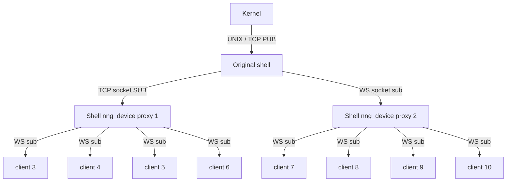

# Initial Work On The Explorer
Explorers are indispensable tools for any decentralized system, allowing users to seamlessly navigate through transactions and metrics. Beyond mere functionality, an explorer serves as a testament to the vitality of a network. While the core team won't directly build the explorer, we are committed to crafting the essential tools and patterns. If you're inclined towards front-end work, we encourage you to get in touch with us!

## First Goals
Creating an effective explorer involves addressing specific goals and adhering to key design considerations:

1. **Snappy User Experience**: The explorer should deliver information promptly, minimizing the need for page reloads to display data on the front page.

2. **Non-Intrusive to Node Kernel**: The explorer must not burden the node kernel, ensuring it doesn't interfere with the core functionality of a node. Scalability is paramount as the system is expected to handle increasing amounts of information.

3. **Easily extendable**: It should be easy to create new functionality on the explorer without the need to change stuff further up the chain.

## Implementation Strategies

To achieve the outlined goals, we employ a combination of technologies and strategies:

### Leveraging NNG and Pure Javascript

In our prototype, we utilize NNG-websockets, pure Javascript, and the shell of the Tagion system. By capitalizing on the existing PUB-SUB NNG web-sockets, we effortlessly push messages directly to frontend subscribers without introducing middleware.
Since loading the kernel/node is undesirable, we use the shell to proxy the sockets. The scalability is ensured through the use of `nng_device`, which allows us to proxy pubsub sockets, enabling multiple machines to forward requests seamlessly.

This architecture ensures that a single node can effortlessly scale to accommodate millions of clients.

### Frontend Development
On the frontend, a [simple prototype](https://github.com/tagion/global-money-tree) has been created using only Javascript and a minimal 100-line dependency on a [javascript wrapper](https://github.com/void-dragon/nanomsg-browser) for NNG websockets. This prototype is encapsulated within a single index.html file.

## Future Steps
Presently, the explorer transmits [HiBONJSON](https://www.hibon.org/posts/hibonjson/) due to a lack of a HiBON deserialization method in Javascript. The upcoming TVM, utilizing WASM, aims to compile HiBON into wasm for seamless integration on the client side as well. This will facilitate easier handling of [DART requests](/protocols/hirpcmethods.md) directly from the client to a node shell through a REQ/REP socket.
The potential integration of the hashgraph monitor is also on the horizon. We have already created an iframe for the hashgraph which needs to be made compatible with NNG web-sockets in order for it to work.
