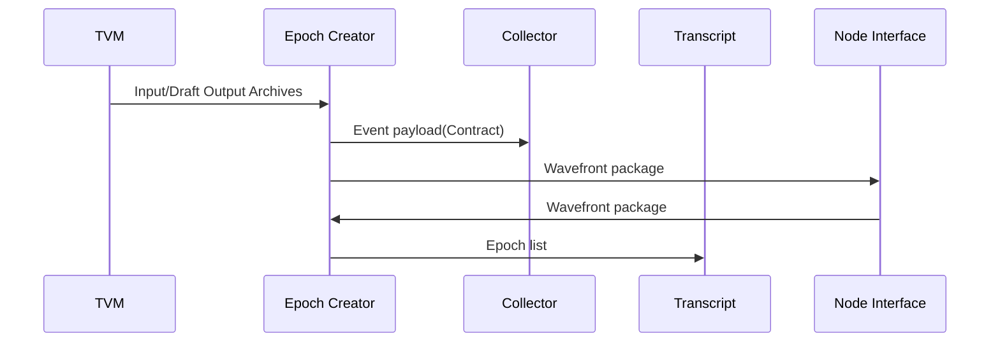

# Epoch Creator Service

This service is responsible for resolving the Hashgraph and producing a consensus ordered list of events, an Epoch.

Input:
  - A Contract-SC (Signed Consensus) is received from the [TVM](/docs/architecture/TVM.md) Service. 
  - Wavefront packages received from the [Node Interface](/docs/architecture/NodeInterface.md) Service.

Output:
  - Wavefront packages is sent to the [Node Interface](/docs/architecture/NodeInterface.md) Service.
  - Epoch list is sent to the [Transcript services](/docs/architecture/Transcript.md).

The diagram below shows the possible information send from and to the Epoch Creator service.

