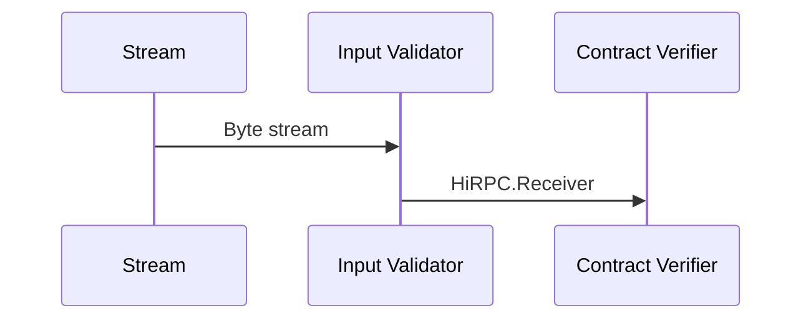

# Input Validator Service

[tagion.services.inputvalidator](https://ddoc.tagion.org/tagion.services.inputvalidator)

This service splits the stream into a [HiBON Document](/docis/protocols/hibon) and send package to the next service.
The services should check that the package does not exceed the max-package length.

Input:
> - Package Byte stream

Output:
> - A [HiRPC](https://www.hibon.org/posts/hirpc).Receiver is converted from the byte stream 

The services does the following:
- Check that the size of the package does not exceed max-package length.
- Puts the length and the package into one byte string.
- Check that the byte stream is a correct HiBON document format.
- Construct a HiRPC form the HiBON Document.
- Send the data-package to the Contract Verifier service.

If one or more of the stages fails an error should be logged and the HiPRC should not be passed on.

