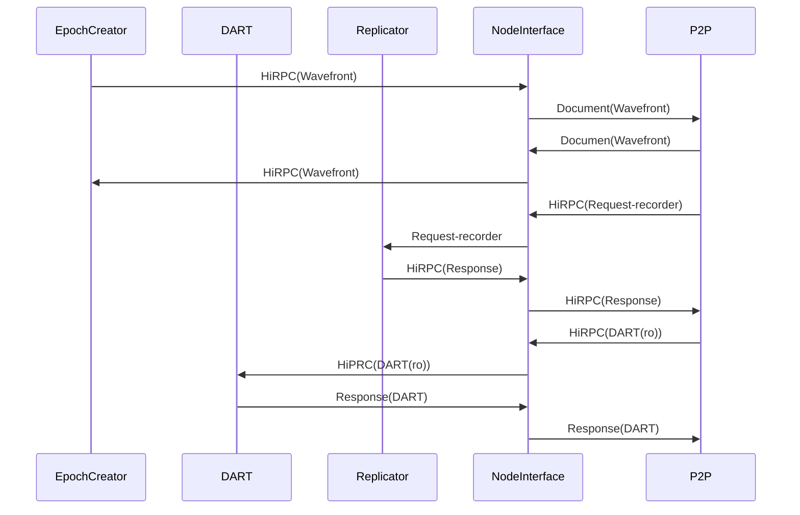

# Node Interface Services

This service is responsible for handling and routing requests to and from the p2p node network.

All the package information is in **HiPRC** format.

The Node interface services relays the HiRPC between three  services (*EpochCreator, Replicator, DART*) depended on the HiRPC(Method) or the services deriven key.

All HiRPC should be signed and contain a pubkey.

