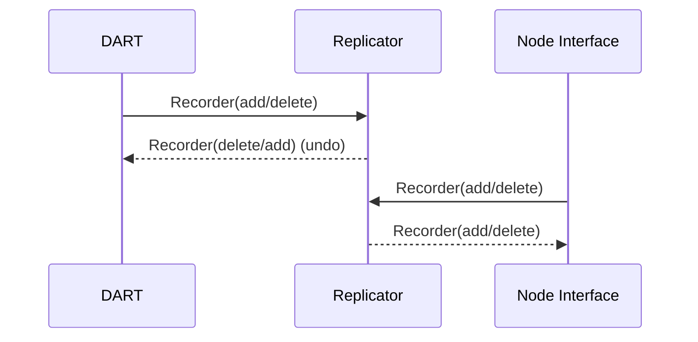

# Replicator Services

This service is responsible for keeping record of the database instructions, the Recorders in a sequential order. It serves the purpose of being able to undo a Recorder in the Database and to sync. with other nodes.

Input:
  -  A Recorder(add/delete) is received from the [DART](/documents/architecture/DART.md) Service.
  -  A Request is received from the [Node Interface](/documents/architecture/NodeInterface.md) Service.

Output:
  -  A Recorder(add/delete) is sent to the [Node Interface](/documents/architecture/NodeInterface.md) Service.
  -  A Recorder(add/delete) (undo) is sent to the [DART](/documents/architecture/DART.md) Service.

The acceptance criteria specification process can be found in [Replicator](
/bdd/tagion/testbench/services/Replicator.md)

The Recorder protocol can be found in [Recorder](documents/protocols/dart/Recorder.md)
