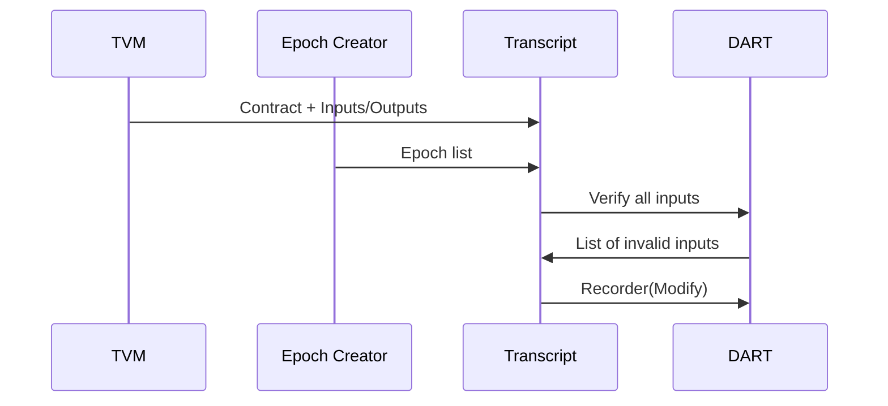

# Transcript Service

This service is responsible for producing a Recorder ensuring correct inputs and output archives including no double input and output in the same Epoch and sending it to the DART.

Input:
  - Receives an Epoch list containing ordered events from the [Epoch Creator](/docs/architecture/EpochCreator).
  - Receives all Draft outputs archives from the [TVM](/docs/architecture/TVM).

Request:
  - Request to all the inputs archives from the [DART](/docs/architecture/DART).

Output:
  - A DART-recorder is sent to the [DART](/docs/architecture/DART)

This services performs the following:
```{r, eval=FALSE,tidy=FALSE}
Collect all the inputs/output archives related to the contract
WHEN an list of $epochs has been received 
    Clear the input used list
    LOOP through each contract in the Epoch list
        IF inputs of the contract exists in the DART and is not in the used list THEN
            Mark the input archives as remove in the Recorder.
            Add the epoch number to the output archives.
            Mark the output archives as add in the Recorder.
            Add the inputs to the used list
        END
    END
    Send the Recorder to the DART.

```

The acceptance criteria specification can be found in [Transcript_services](https://github.com/tagion/tagion/tree/master/bdd/tagion/testbench/services/ContractInterface_service).



