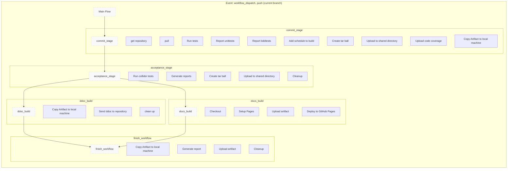

# Systemic overview
The overall purpose is to deliver continuous value to our users by:
using the scientific method to learn as fast as possible - fail fast.
We do this by an automated CI/CD flow that always produces a deployment candidate, which we can choose to deploy at any time.
The quality is defined by the requirements to the systems expressed in tests.

# Systemic overview tests

# Deployment Pipeline

# Deployment Infastructure
[servers](https://www.notion.so/decardcorp/CI-Infrastructure-e6f10802b67548148f2a970e10f14936)

# Sequential diagram over workflow

