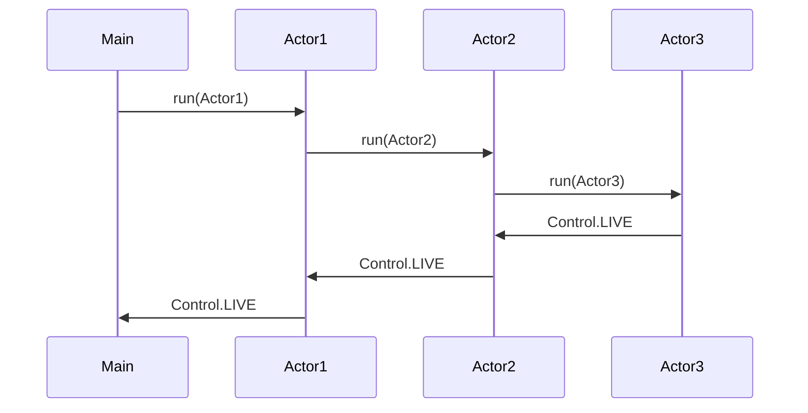
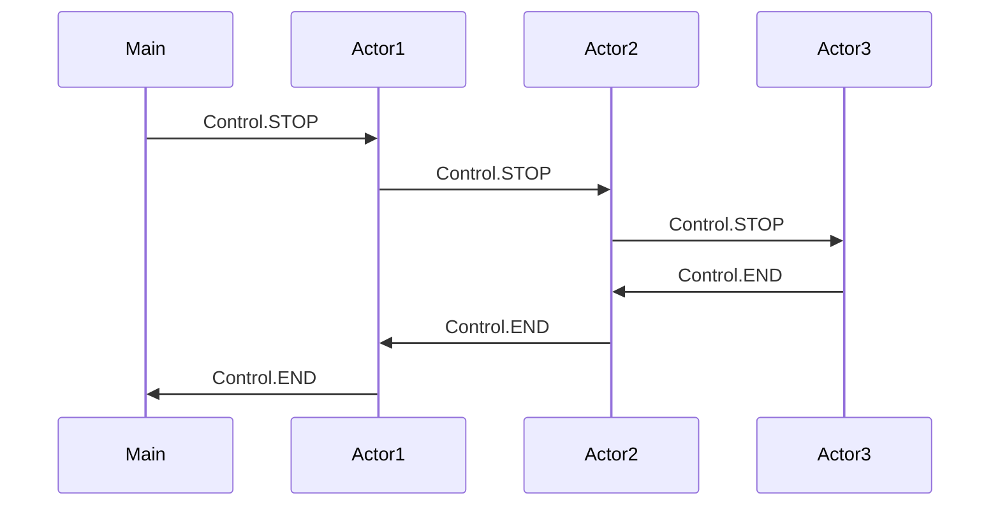

# Requirement for the Actor base multitasking
An actor is a task that is able to send and receive messages from other tasks.
The actors have a hierarchical structure where the owner of an actor is called a supervisor and the actor owned by the supervisor is called a child.

When an actor fails the error is sent to the to the supervisor if the error is deemed unrecoverable the supervisor can decide to restart the supervision tree.
Since most of our services have dependant states on each other it would be almost impossible to restart a subtree. We have decided to use the 'one for all strategy' [^1] which mean that if one part fails we restart the entire supervision tree. 

[^1]: Erlang Supervision Principles https://erlang.org/documentation/doc-4.9.1/doc/design_principles/sup_princ.html

And actor can have 3 Control stages

| Mode | Stage    | Description                                                        |
| ---- | -------- | ------------------------------------------------------------------ |
|  1.  | STARTING | When actor is starting and initializing the actor                  |
|  2.  | ALIVE    | When the actor has started a LIVE signal is send to the supervisor |
|  4.  | END      | When the actor stops a END signal is send to the supervisor        |

Additionally a FAIL is sent when the running task catches an exception. Containing the taskname and the exception.

child stops when a supervisor sends a STOP signal to the child and the child sends an END when it stops if an error occurs in the child the error (Exception) should be sent to the supervisor.

An actor has a set of received methods and this set of methods should never change as long as the actor is alive.

## Start and Stop of Actor hierarchy 

This diagram shows an example of the startup sequence of the supervisor hierarchy

This diagram shows the stop sequence.

