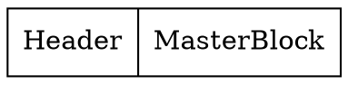
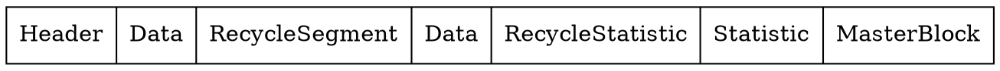
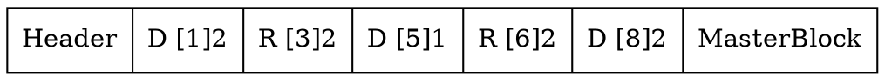
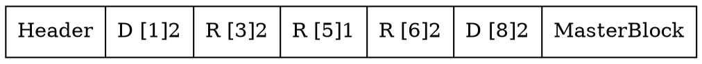
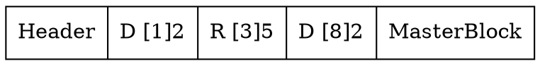

# BlockFile 
See the [ddoc documentation](https://ddoc.tagion.org/tagion.dart.BlockFile.html).


The BlockFile, utilized under our DART, functions as a block-based storage system, where data is segregated into fixed-size blocks, typically a few kilobytes, and assigned a unique index, which the file system uses to track the location of the stored data. When a file is saved or modified, the file system writes the data to one or more available blocks and updates its index accordingly. 

The BlockFile has a wrapper on the blocks in order to make development easier. This is called BlockSegment.

## BlockSegment
The BlockSegment is a `Document` (immutable HiBON) and a `Index`. All data stored in the BlockFile is stored using Documents (except the headerblock).
One BlockSegment equals one Document. Therefore a Document can span multiple blocks. The Index specifies where the Document is written to in the BlockFile.
Since the Document might fill 1.5 blocks a function is needed in order to get the correct number of blocks. In order to get the number of blocks we do the following:
* Get the size of the Document. (LEB128) encoding of the size in order to save space.

$$
\text{numberOfBlocks} = \lfloor \frac{\text{size}}{\text{BLOCK\_SIZE}} \rfloor + (\text{size mod BLOCK\_SIZE = 0} \text{ ? 0 : 1})
$$

Where the size refers to the `size_t` of the Document. Therefore the `BlockSegment` contains the following:

| Variable Name | Type       | Label        | Description                                                  |
|---------------|------------|--------------|--------------------------------------------------------------|
| `index`       | `Index`    | `"index"`    | Index where the document is stored or should be stored.      |
| `doc`         | `Document` | `"Document"` | Document stored in the segment                               |


## General BlockFile structure
An empty blockfile without any archives in it has the following structure:



The `HeaderBlock` is always the first block and specifies how to read the file. The [MasterBlock](https://ddoc.tagion.org/tagion.dart.BlockFile.BlockFile.MasterBlock.html) is always the last block and is the only one with references backwards in the blockfile. The following is what a blockfile with data might look like.



The following sections describe what the different segments are.

### HeaderBlock
The HeaderBlock contains the following information:

| Variable Name | Type               | Description                       |
|---------------|--------------------|-----------------------------------|
| `label`       | `char[LABEL_SIZE]` | Label to set the `BlockFile` type |
| `block_size`  | `uint`             | Size of the block's               |
| `create_time` | `long`             | Time of creation                  |
| `id`          | `char[ID_SIZE]`    | Short description string          |

The HeaderBlock is not a Document since it needs to be compatible with standard file lookups. 

### [MasterBlock](https://ddoc.tagion.org/tagion.dart.BlockFile.BlockFile.MasterBlock.html)
When the HeaderBlock is read, it sets the variable used by the masterblock called `last_block_index`. This is because we know that the [MasterBlock](https://ddoc.tagion.org/tagion.dart.BlockFile.BlockFile.MasterBlock.html) is always the last block.
$$ \text{last\_block\_index} = \frac{\text{file.size}}{\text{BLOCK\_SIZE}} -1 $$
The reason we subtract 1 is to get the Index of where the masterblock begins. The masterblock is **always one block**.

The [MasterBlock](https://ddoc.tagion.org/tagion.dart.BlockFile.BlockFile.MasterBlock.html) has pointers to all other different important blocks in the BlockFile. It contains the following information:

| Variable Name              | Type    | Label        | Description                                  |
|----------------------------|---------|--------------|----------------------------------------------|
| `recycle_header_index`     | `Index` | `"head"`     | Points to the root of the recycle block list |
| `root_index`               | `Index` | `"root"`     | Points to the root of the database           |
| `statistic_index`          | `Index` | `"block_s"`  | Points to the statistic data                 |
| `recycler_statistic_index` | `Index` | `recycle_s"` | Points to the recycler statistic data        |

The labels indicate the names that are used in the Document stored in the [MasterBlock](https://ddoc.tagion.org/tagion.dart.BlockFile.BlockFile.MasterBlock.html).

### [RecycleSegments](https://ddoc.tagion.org/tagion.dart.Recycler.RecycleSegment.html)
[RecycleSegments](https://ddoc.tagion.org/tagion.dart.Recycler.RecycleSegment.html)
 are special, because they point to the next `RecycleSegment` instead of pointing to the next BlockSegment.
This allows us to get a list of all the segments that are "recycled. They contain the following:

| Variable Name | Type    | Label    | Description           |
|---------------|---------|----------|-----------------------|
| `index`       | `Index` | `VOID`   | Current field's index |
| `next`        | `Index` | `"next"` | Points to next index  |
| `size`        | `uint`  | `"size"` | Size of the field     |

As it can be seen the `index` is not saved in the `HiBONRecord`. This is because it is not neccesary in order to produce the list of [RecycleSegments](https://ddoc.tagion.org/tagion.dart.Recycler.RecycleSegment.html)
. 

The RecycleSegments are stored in a [RedBlackTree](https://dlang.org/phobos/std_container_rbtree.html) in memory called [indices](https://ddoc.tagion.org/tagion.dart.Recycler.Indices.html).
The reason they are stored in memory is in order to quickly find a segment that fits.
The read is instantiated from the `recycler_header_index` which is a part of the [MasterBlock](#masterblock). The last segment in the recyclersegments points to nothing: `Index.init`. 
The code for reading all the recyclersegments are as follows.

```d
// The last element points to a Index.init. 
// Therefore we continue until we reach this.
while (index != Index.init) {
   auto add_segment = new RecycleSegment(owner, index);
   insert(add_segment);
   index = add_segment.next;
}
```

### Statistic Blocks
Statistic segments are used for analyzing the amount of blocks and how well they are used, and how many recycle segments. 
They use the underlying `logger/Statistic` module, and are Type Definitions.

```d
alias BlockFileStatistic = Statistic!(uint, Yes.histogram);
alias RecyclerFileStatistic = Statistic!(ulong, Yes.histogram);
```

The Yes.histogram indicates that we are keeping track each time `blockfile.store` is called. This means that we can see how the number of ex. `RecycleSegments` grows over time.

The following is an example of the command: `blockutil test.drt --recyclerstatistic`.

```
N=101 sum2=704 sum=240 min=0 max=5
   0|   8| ########
   1|  12| ############
   2|  32| ################################
   3|  34| ##################################
   4|  13| #############
   5|   2| ##
```


## Save and dispose functions (Recycler)
The two most important functions in the blockfile is the `save` and `dispose` functions.
The `save` function is responsible for saving the document to the blockfile.
It calls the claim function in the `Recycler` with the amount of blocks it needs in order to save the data. The `Recycler` responds with a Index where the data should be stored.
The purpose of the recycler is to keep track of erased blocks. This is important in order for the file not to continue growing even though that data is deleted. 

### [Dispose](https://ddoc.tagion.org/tagion.dart.Recycler.Recycler.dispose.html) in recycler
The dispose in the recycler simply creates a new `RecycleSegment` and adds it to the list called [`to_be_recycled`](https://ddoc.tagion.org/tagion.dart.Recycler.Recycler.to_be_recycled.html). 

### [Claim](https://ddoc.tagion.org/tagion.dart.Recycler.Recycler.claim.html) in recycler
The claim in the recycler first checks a internal list called `to_be_recycled`. This list contains all the disposed segments that are going to be added to the recycler when the `blockfile.store` function is called. If it finds a segment in the `to_be_recycled`, which is the same size amount of blocks neccesary to store the document, it returns the index.

If no segment in the `to_be_recycled` is found, we do the following:

1. Create a search segment of the segment_size.
2. Get the `equalRange` meaning all the segments in the `indices` that are equal by the segment_size.
3. If the `equalRange` is not empty. Remove the found segment from the indices and return its index.
4. If the `equalRange` is empty. We perform the same on the `upperRange` giving us all segments that are greater than us.
5. If the `upperRange` is not empty. We take the `front` element giving us the one that fits the best.
6. If the `upperRange` is empty. We return `blockfile.last_block_index`, and on scope exit add the `blockfile.last_block_index += segment_size`.

### Recycle ([recycle](https://ddoc.tagion.org/tagion.dart.Recycler.Recycler.recycle.html))
Every time `blockfile.store` is called we call the function `recycle(to_be_recycled)`. This function is responsible for amalgamating segments in the recycler that are touching each other. Lets say we have the following structure.

The segments are `TYPE [INDEX]SIZE`. Using shorthand for the names were `D` is data, `R` is recyclesegment.


Now lets say that we have the list `to_be_recycled`, and it contains one segment with `Index(5), size=1`. This means we need to add this segment to the recycler.
If we add it directly we would get the following:

This leads to problems further down the line. Because now if i want to claim a segment (*Remove a segment from the recycler*) that was `size=5`, then i would not be able to do so other than adding a segment at the last_block_index even though we have enough space. Therefore we merge the segments in the recycle function so that we produce the following:

The algorithm for doing this is the following.

```d
foreach (insert_segment; to_be_recycled) {
   auto lower_range = indices.lowerBound(insert_segment);
   if (!lower_range.empty && lower_range.back.end == insert_segment.index) {

         insert_segment.index = lower_range.back.index;
         insert_segment.size = lower_range.back.size + insert_segment.size;
         // remove the lowerrange segment since we have created a new segment 
         // that incorporates this segment.
         remove(lower_range.back);
   }

   auto upper_range = indices.upperBound(insert_segment);
   if (!upper_range.empty && upper_range.front.index == insert_segment.end) {
         insert_segment.size = upper_range.front.size + insert_segment.size;
         remove(upper_range.front);
   }
   // lastly we insert the new segment.
   insert(insert_segment);

}
```

The code loops through the `to_be_recycled` and performs a sequence of operations on `indices`. It first finds the first element in `indices` that is less than or equal to `insert_segment` using `lowerBound`. If the `end` property of the found element matches `insert_segment`'s `index`, it merges the two segments, removes the previous element from `indices`, and updates `insert_segment`. 

Then, using `upperBound`, the code finds the first element in `indices` that is greater than `insert_segment`. If the `index` property of the found element matches `insert_segment`'s `end`, it merges the two segments, removes the element from `indices`, and updates `insert_segment`. Finally, `insert_segment` is added to `indices`.
