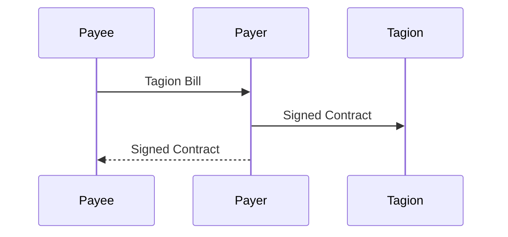
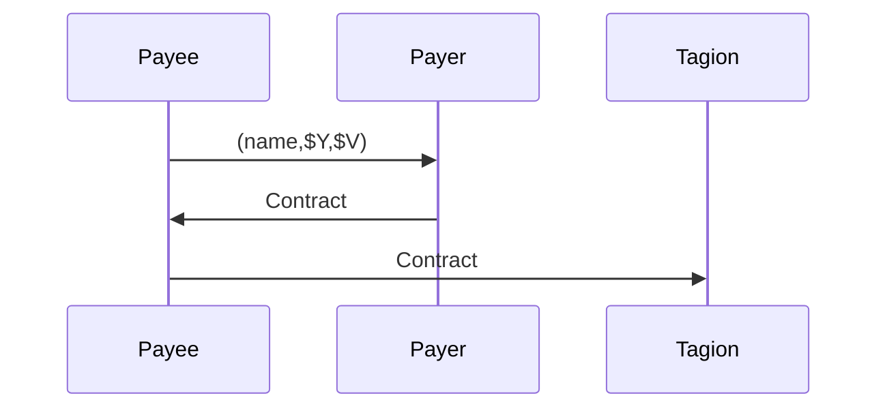

# Payment transfer

## Simple transfer Payment
A simple payment can be initiated from the `payee`.

> - The `payee` creates a [TagionBill](/docs/protocols/contract/bill) to the `payer`.
> - The `payer` creates a contract with the bill as output and send it to the network.
> - The `payer`  can send the signed contract back as a of intent.

## Request for payment
The request for payment include an name of the receiver and seed public key.

### Payment Request(Request)

| Name        | D-Type       | Description            |  Required |
| ----------- | ------------ | ---------------------- | --------- |
| `name`      | string       | Owner or alias name    |    Yes    |
| `$Y`        | Pubkey   | Public key seed        |    Yes    |
| `$D`        | string       | Deriver                |    Yes    |
| `$V`        | $TGN$        | Amount in tagion       |    No     |
| `info`      | Document | Payment information    |    No     |

Payment request payment.

