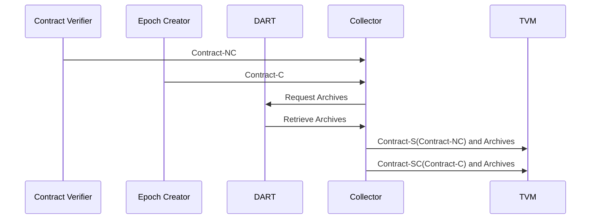

# Collector Service

The service is responsible for collecting input data for a Contract and ensuring the data is valid and signed before the contract is executed by the TVM.

Input:
  - A Contract-NC (No Consensus) received from [HiRPC Verifier](/docs/architecture/HiRPCVerifier.md) Service.
  - Contract-C received from [Epoch Creator](/docs/architecture/EpochCreator.md) Service.

Request:
  - Request and retrieve archives from the [DART](/docs/architecture/DART.md) Service.

Output:
  - A Contract-S (A Signed Contract) and archives sent to [TVM](/docs/architecture/TVM.md). 
  - A Contract-SC (A Signed Consensus Contract) and archives sent to [TVM](/docs/architecture/TVM.md). 

 The service does the following:

  - Does contract format validation on the Contract-C.
  - Collects the contract input data, DART archives, from the DART as specified.
  - Ensures all input data is valid and signed correctly.
  - If input is a Contract-NC it sends a Contract-S and archives to the TVM.
  - If input is a Contract-C it sends a Contract-SC and archives to the TVM.

