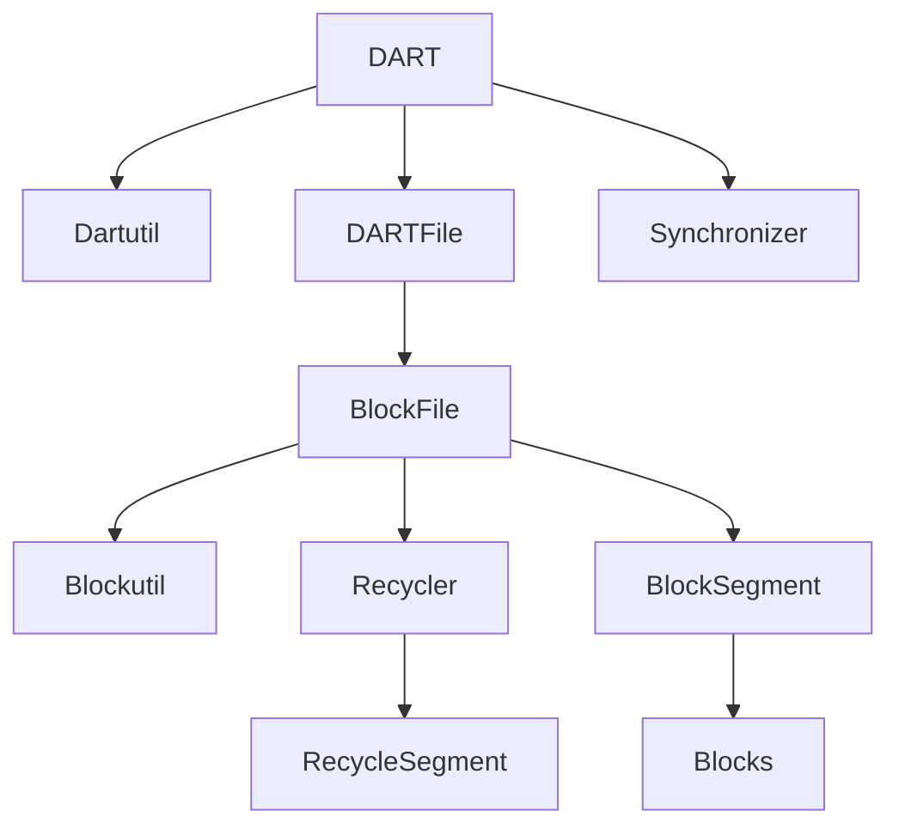
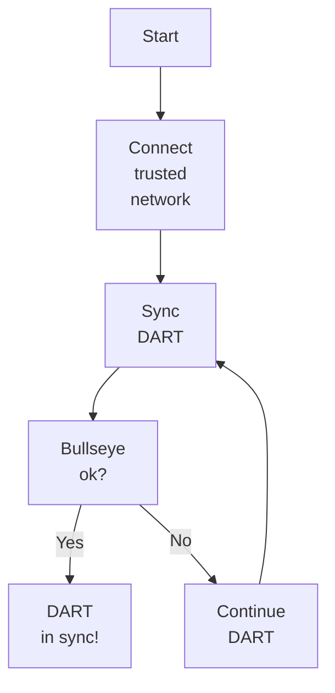
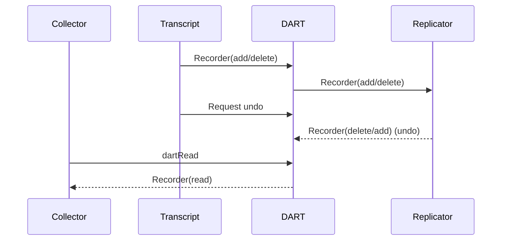

# DART Service
## General structure of the DART modules

# DARTFile structure

## CRUD

This service is responsible for executing data-base instruction and read/write to the physical file system.

Note.
The DART does not support `update` only `add` and `delete`. 

The DART database support 4 **DART(crud)** commands.
  - `dartBullseye` returns the bullseye (Merkle root) of the DART.
  - `dartRim` reads a list of branch(tree) for a given rim.
  - `dartRead` reads a list of archives from a list of fingerprints.
  - `dartModify` adds and deletes a list of archives form a Recorder.

The `dartModify` should only be executed inside a Node, either from the transcript or when the nodes starts up in the DART sync process.

The read-only dart command **DART(ro)** is defined as `dartBullseye`, `dartRim` and `dartRead`.

All archives in the database has a unique hash-value called fingerprint.

Input:
  - Recorder is received from the [Transcript](/docs/architecture/Transcript.md) Service.
  - Undo-instruction is received from the [Transcript](/docs/architecture/Transcript.md) Service.
  - Recorder rewind is received from the [Replicator](/docs/architecture/Replicator.md) Service.

Request:
  - **DART(ro)** commands from the [Node Interface](/docs/architecture/NodeInterface.md)) Service.

Output:
  - Last Recoder is sent to the [Replicator](/docs/architecture/Replicator.md) Service. 

### DART Start up
When a node goes online the DART needs to be synchronized with other nodes in the network.
Before the DART should be synchronized the node should run trough the discovery of the trusted network (This process is not described here)

The DART database should be synchronized before the DART can be used as a consensus database.

DART start-up flowchart:

Note. The synchronization method can be found in DART. SynchronizationFiber which also support HiPRC. 
For sample code see the unittest in the DART module.
DART also includes a journal-files which can be used in case of a crash.

### DART Operation

When the DART success-fully has reached the current bullseye state then the DART is ready to receive Recorders from the transcript service. That will keep the DART in the consensus state as long as the network produces Epochs and Recorders.

In the case that an Epoch do not have majority voting on the last bullseye, then the Transcript Service sends a DART undo command to the DART services. This means that the previous Recorder must be undo and this is done by requesting the Recorder from the Replicator and the Recorder is reversed by the `dartModify` command. 
The bullseye after the Recorder has been executed is written into the next Epoch to ensure the consensus state of the database. In other words, a database state is first final in the next consensus round if all the network participants have agreed on the state. That is the last valid consensus database state, consensus bullseye, in the network.

The acceptance criteria specification can be found in [DART Service](https://github.com/tagion/tagion/tree/master/bdd/tagion/testbench/services/DART_Service.md)

