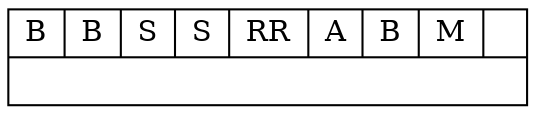

# blockutil

## help
```
Usage:
blockutil <file> [<option>...]

Where:

<option>:
             --version Display the version
                --dump Dumps the entire blockfile
        --dumprecycler Dumps the recycler
-r --recyclerstatistic Dumps the recycler statistic block
-s         --statistic Dumps the statistic block
-g         --dumpgraph Dump the blockfile in graphviz format
-d           --dumpdoc Dump the document located at an specific index
-i             --index the index to dump the document from
-h              --help This help information.```
```
## dump
### dump the entire blockfile
```
blockutil filename.blk --dump
```
Returns ex:
```
Block map
|TYPE [INDEX]SIZE
|Branches [1]1|Branches [2]1|S [3]1|S [4]1|R [5]2| [7]1|
|Branches [8]1|M [9]1|
```

### dump the recycler
```
blockutil filename.blk --dumprecycler 
```
Returns ex:
```
Recycler map
Index(5), size(2), next(0
```
### statistic dump
```
blockutil filename.blk --statistic
blockutil filename.blk -s
```
Returns ex:
```
N=11 sum2=11 sum=11 min=1 max=1
   1|  11| ###########
```

### dumpgraph
```
blockutil filename.blk --dumpgraph
blockutil filename.blk --dg
```
Returns ex:


### dumpdoc
``` 
blockutil filename.blk --dumpdoc --index 10
```
Dumps the index document. Can be used with hibonutil stdin to get the hibon ex.

```
blockutil dart_mapping_two_archives.drt --dumpdoc --index 2 | hibonutil -o test.hibon
```

