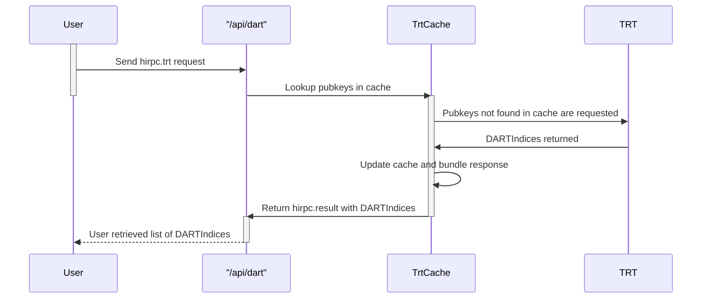
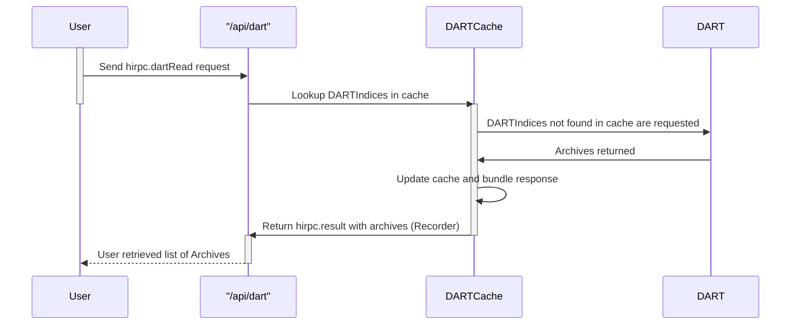
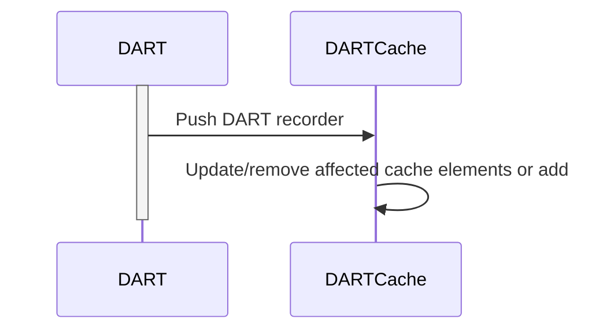
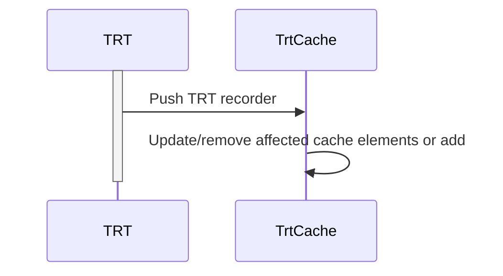

# Cache

# Current problems with cache and system interfaces.
The cache does not have "bucket" storage on pubkeys meaning that it will not work in its current format, if a user has multiple bills on the same pubkey.
This could be fixed by updating the cache to have bucket storage, and each time we have a update from the dart in the recorder regarding a bill, we construct a new search request for all bills pubkeys and send against the dart.

The problem with the above idea, is in case that a user has many bills on a single pubkey, we might need to return 1000 bills on a request, which is not a scalable solution. Maybe it is better to update the requests?


## Proposed solution
We introduce a new method called `hirpc.trt` (And also deprecate `hirpc.search` which goal is to return all `DARTIndices` for a specifc public key. This will greatly reduce the overall response since a `DARTIndices` is only `32` bytes.

1. The user sends a `hirpc.trt` request on all their public keys and gets all dartindices back where archives were found from the TRT ("or cache"). 
2. The user checks for bills in their bill[] on the responded dartindexs. If some bills are found in their bill[] but were not in the response, the bill is no longer in the system and has been deleted. Likewise if some bills are not found in their bill[] but were found in their response the user might have received further payment.
3. The user takes the public keys which were not found in the bill[] but in the response, and performs a `hirpc.dartRead` only on the indices that are neccesary to read (new archives).
4. The user is returned the new found archives which the user was the owner of. 


A cache is also created which contains `Document[DARTIndex]` making the lookup on a index very fast and acts as a cache layer on the `DART`.
The current cache is changed so that instead of holding `TagionBill[Pubkey]` it contains `DARTIndex[][Pubkey]` and acts as a cache layer on the `TRT`. Like the other cache it needs to update itself based on the recorder changes and create new trt requests.


# Performing a `hirpc.trt`


# Performing a `hirpc.dartRead`

# Updating DARTCache internally



# Updating TrtCache internally
The TRT can push its updates to a cache just like the DART does. This is done by pushing the recorder that it modifies itself with. This recorder contains a "full list" of all documents located on a specific public key: 
```dlang
struct TRTArchive {
    @label(TRTLabel) Pubkey owner;
    DARTIndex[] indices;

    mixin HiBONRecord!(q{
        this(Pubkey owner, DARTIndex[] indices) {
            this.owner = owner;
            this.indices = indices;
        }
    });
}
```
Therefore from the recorder the cache is able to update itself.

Other than the above specified cache update the cache also updates itself on new requests from users.

