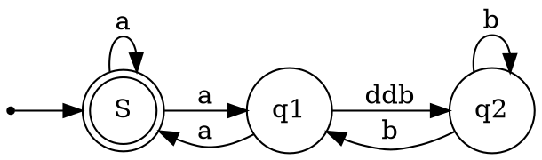

# Test

[Alt text](https://g.gravizo.com/source/custom_mark20?https%3A%2F%2Fraw.githubusercontent.com%2FTLmaK0%2Fgravizo%2Fmaster%2FREADME.md)

 

custom_mark20	
@startwbs
* Business Process Modelling WBS
** Launch the project
*** Complete Stakeholder Research
*** Initial Implementation Plan
** Design phase
*** Model of AsIs Processes Completed
**** Model of AsIs Processes Completed1
**** Model of AsIs Processes Completed2
*** Measure AsIs performance metrics
*** Identify Quick Wins
** Complete innovate phase
@endwbs
custom_mark20

