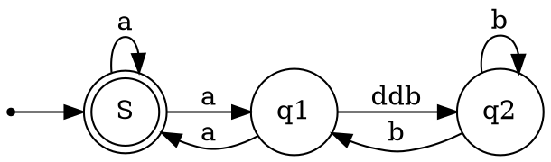

# Test

[Alt text](https://g.gravizo.com/source/custom_mark20?https%3A%2F%2Fraw.githubusercontent.com%2FTLmaK0%2Fgravizo%2Fmaster%2FREADME.md)
<details> 
<summary></summary>
custom_mark20	
@startwbs
* Business Process Modelling WBS
** Launch the project
*** Complete Stakeholder Research
*** Initial Implementation Plan
** Design phase
*** Model of AsIs Processes Completed
**** Model of AsIs Processes Completed1
**** Model of AsIs Processes Completed2
*** Measure AsIs performance metrics
*** Identify Quick Wins
** Complete innovate phase
@endwbs
custom_mark20
</details>


```mermaid
digraph tagion_hierarchy {
    rankdir=UD;
    size="8,5"
   node [style=filled]
Tagionwave [color=blue]
DART [shape = cylinder]
Transaction [shape = signature]
Transcript [shape = note]
Collector [color=red]
node [shape = rect];
	Tagionwave -> Logger -> LoggerSubscription;
	Tagionwave -> TagionFactory;
	TagionFactory -> Tagion;
	Tagion -> P2PNetwork ;
	P2PNetwork;
	DART -> Recoder;
	Tagion -> DART -> DARTSync;
    Tagion -> Consensus;
	Consensus -> Transaction;
	Consensus -> Transcript;
	Consensus -> Collector;
	Transcript -> EpochDump;
	Consensus -> Monitor;
}
```


