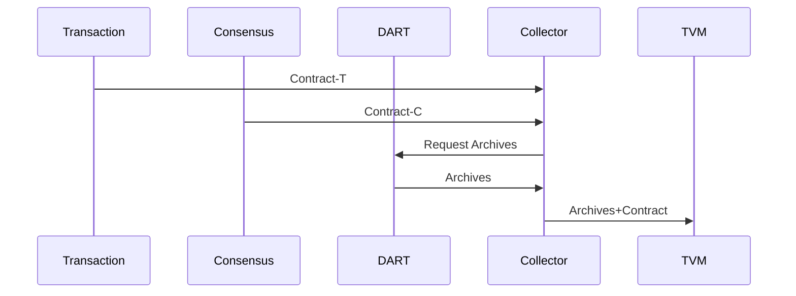

## Collector Service

The service is responsible for collecting input data for a HiRPC request and ensuring the data is valid and signed before the contract is executed.

Input:
  - A Contract-NC (No Consensus).
  - Sender: Communication Service.

  - Contract-C.
  - Sender: Consensus Service.

Request:
  - Request and retrieve archieves from the [DART](/documents/architecture/DART.md) service.

Output:
  - On request send the contracts+inputs+reads

The acceptance criteria specification can be found in [Collector_service](/bdd/tagion/testbench/services/Collector_service.md).

Input:

    - A HiRPC.Receiver request.
    - Sender: Transaction Service.

    - A Signed Consensus Contract
    - Sender: Consensus Service.

 Output:

    - A Signed Contract with Input Data, DART archives. It means all inputs are correct signed in the contract. 
    - Receiver: TVM.

 The service does the following:

    - Reads all the input data, archieves, from the DART as specified as inputs in the HiRPC request.
    - Ensures all input data is valid and signed correctly.
    - Sends a Signed Contract with data to the TVM.