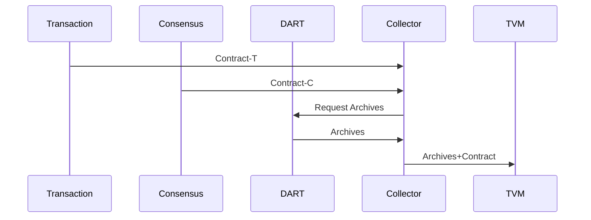

## Collector Services

This services reads all the inputs from the DART which is specified in the smart-contract.

Input:
  - Contract-T received from the Transcript
  - Contract-C received from the Consensus

Request:
  - Request the inputs and reads from the DART

Output:
  - On request send the contracts+inputs+reads

The acceptance criteria specification can be found in [Collector_services](/bdd/tagion/testbench/services/Collector_service.md).

