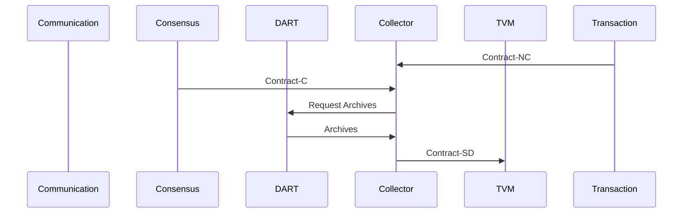

## Collector Service

The service is responsible for collecting input data for a Contract and ensuring the data is valid and signed before the contract is executed by the TVM.

Input:
  - A Contract-NC (No Consensus) received from [Communication](/documents/architecture/Communication.md) Service.
  - Contract-C received from [Consensus](/documents/architecture/Consensus.md) Service.

Request:
  - Request and retrieve archieves from the [DART](/documents/architecture/DART.md) Service.

Output:
  - A Contract and with valid DART archieves, the signed inputs. 

 The service does the following:

    - Does contract valication on the Contract-C.
    - Collects the contract input data, DART archieves, from the DART as specified.
    - Ensures all input data is valid and signed correctly.
    - Sends a Contract-SD (Signed Data) to the TVM.

The acceptance criteria specification can be found in [Collector_service](/bdd/tagion/testbench/services/Collector_service.md).

