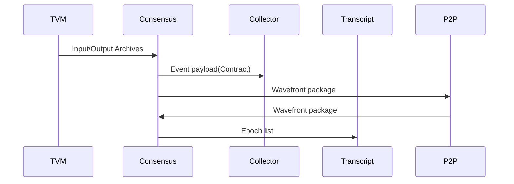

# Consensus Service

This services perform the [HashGraph](HashGraph.md) consensus ordering.

Input:
  - Payload form as document (Typical form the TVM).
  - Wavefront packages from the received from the peer to peer.

Output:
  - Wavefront packages send to a selected node in peer to peer network.
  - Epoch package send to the Transcript services.

The acceptance criteria specification can be found in [Consensus Service](
bdd/tagion/testbench/services/Consensus_Service.md)

The diagram below shows the possible information send from and to the Consensus services.

