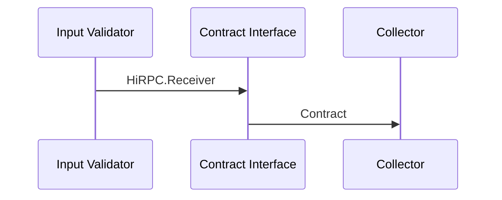

# Contract  Service

This service is responsible for receiving contracts, ensuring a valid data format of HiRPC requests and compliance with the HiRPC protocol before it is executed in the system.

It acts as a gate-keeper ensuring compliance before contracts are send to the Collector Service.

Input:  
> - A [HiPRC](/documents/protocols/hibon/Hash_invariant_Remote_Procedure_Call.md).Receiver received from byte package 

Output:  
> - A [HiBON](/documents/protocols/hibon/Hash_invariant_Binary_Object_Notation.md) Document sent to [Collector](/documents/architecture/Collector.md) Service.

The service does the following:

  - Check the data package comply with size limitation.
  - Validate the HiRPC request is correct formatted.
  - Validates signature on permissioned HiRPC request. 
  - Ensure the HiRPC request complay with the protocol
  - Sends a HiRPC request to the Collector service.

The acceptance criteria specification can be found in [ContractInterface_service](/bdd/tagion/testbench/services/ContractInterface_service.md).

