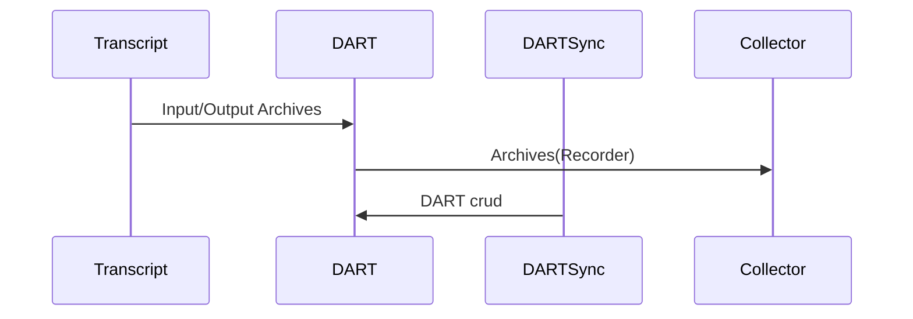

# DART Services

Takes care for DART CRUD commands.

The DART database support 4 crud commands.
  - `dartBullseye` returns the bullseye (Merkle root) of the DART.
  - `dartRim` reads a list of branch(tree) for a given rim.
  - `dartRead` reads a list of archives from a list of fingerprints.
  - `dartModify` adds and deletes a list of archives form a Recorder.

The `dartModify` can only be executed inside the core node not externally.

Note.
The DART does not support `update` only `add` and `delete`. 

All archives in the database has a unique hash-value called fingerprint.

Input:
  - Recorder to the DART.modify command with (do/undo).

Request:
  - DART curd command (`dartRim`,`dartRead` and `dartModify`)
  - DART curd to request the bullseye (`dartBullseye`).

Output:
  - Archive list as a Recorder format.

The acceptance criteria specification can be found in [DART Service](
/bdd/tagion/testbench/services/DART_Service.md)

