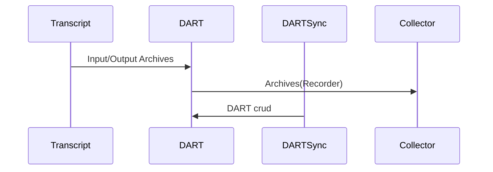

# DART Services

Takes care for DART CRUD commands.

Input:
  - Recorder to the DART.modify command with (do/undo).

Request:
  - DART curd command (`dartRim`,`dartRead` and `dartModify`)
  - DART curd to request the bullseye.

Output:
  - Archive list as a Recorder format.

The acceptance criteria specification can be found in [DART Service](
bdd/tagion/testbench/services/DART_Service.md)

