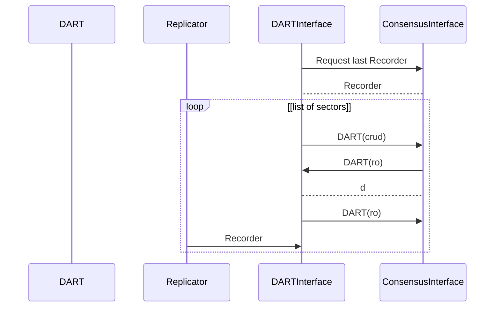

# DARTInterface Services

This services takes care of the remote synchronisation of the DART.

When a node start and after it node has discovered the trusted network. 
The DARTInterface should start to synchronize the DART by subscribing to the produced Recorders from the trusted and after the node should start to synchronize the DART by sectors from a number of trusted nodes.

Input:
  - **DART(ro)** command from ConsensusInterface.
  - Recorder from the Replicator Services.
  - 

Request:
  - Request **DART(ro)** to the ConsensusInterface.
  - Request **DART(crud)** to the DART.

Output:
  - y

Note. The synchronization method can be found in DART.SynchronizationFiber which also support HiPRC. 
For sample code see the unittest in the DART module.
DART also includes a journal-files which can be used in case of a crash.

### DART Synchronization start up

