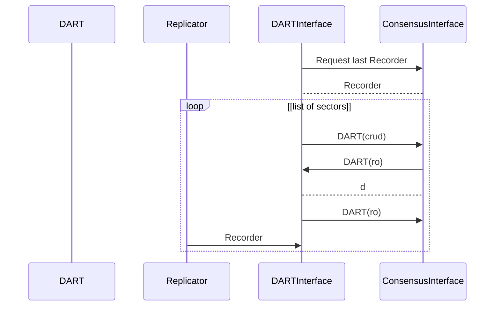

# DARTInterface Services

This services takes care of the remote synchronisation of the DART.

When a node start and after it node has discovered the trusted network. 

Input:
  - **DART(ro)** command from ConsensusInterface.
  - Recorder from the Replicator Services.
  - 

Request:
  - Request **DART(ro)** to the ConsensusInterface.
  - Request **DART(crud)** to the DART.

Output:
  - y

### DART Synchronization start up

