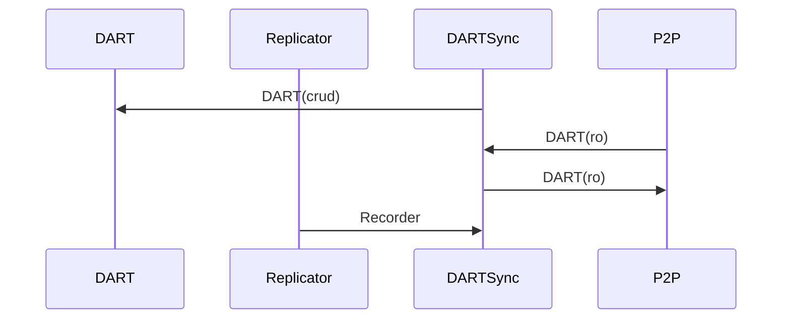

# DARTSync Services

This services takes care of the remote synchronisation of the DART.

Input:
  - **DART(ro)** command from P2P.
  - Recorder from the Replicator Services.

Request:
  - Request a **DART(ro)** to the P2P

Output:
  - y

