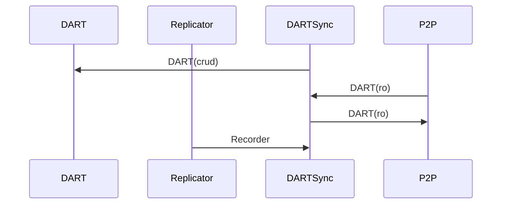

# DARTSync Services

This services takes care of the remote synchronisation of the DART.

Input:
  - DART crud command for.
  - Recorder form the Replicator Services.

Request:
  - 

Output:

```mermaid
sequenceDiagram
    participant DART 
    participant Replicator 
    participant DARTSync 
    participant P2P 
    DARTSync ->> DART: DART(crud)
    P2P ->> DARTSync: DART(ro)
    DARTSync ->> P2P: DART(ro)
    Replicator ->> DARTSync: Recorder
```

