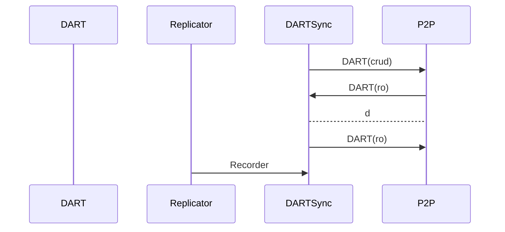

# DARTSync Services

This services takes care of the remote synchronisation of the DART.

When a node start and after it node has discovered the trusted network. 
The DARTSync should start to synchronize the DART by subscribing to the produced Recorders from the trusted and after the node should start to synchronize the DART by sectors from a number of trusted nodes.

Input:
  - **DART(ro)** command from P2P.
  - Recorder from the Replicator Services.
  - 

Request:
  - Request **DART(ro)** to the P2P.
  - Request **DART(crud)** to the DART.

Output:
  - y

PP
### DART Synchronization start up

