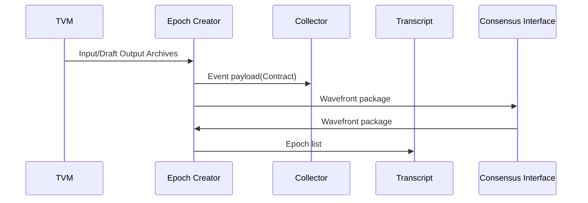

# Epoch Creator Service

This service is responsbile for resolving the Hashgraph and producing a consensus ordered list of events, an Epoch.

Input:
  - A Contract-SC (Signed Consensus) is received from the [TVM](/documents/architecture/TVM.md) Service. 
  - Wavefront packages received from the [Consensus Interface](/documents/architecture/ConsensusInterface.md) Service.

Output:
  - Wavefront packages is sent to the [Consensus Interface](/documents/architecture/ConsensusInterface.md) Service.
  - Epoch list is sent to the [Transcript services](/documents/architecture/Transcript.md).

The acceptance criteria specification can be found in [Epoch Creator Service](/bdd/tagion/testbench/services/EpochCreator_Service.md)

The diagram below shows the possible information send from and to the Consensus services.

