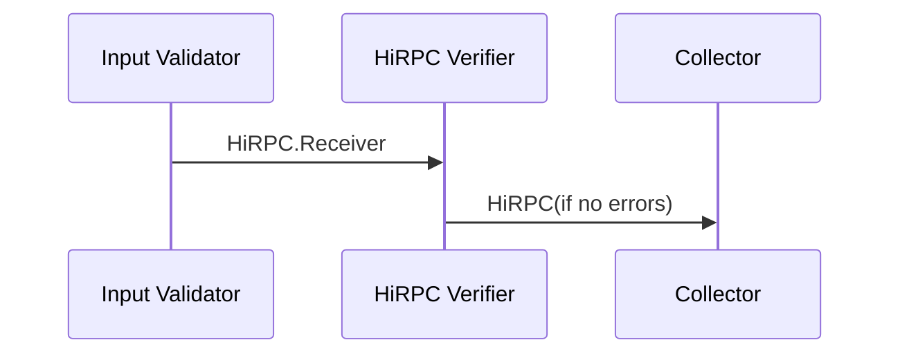

# HiRPC Verifier Service

[tagion.services.hirpc_verifier](ddoc://tagion.services.hirpc_verifier)

This service is responsible for receiving contracts, ensuring a valid data format of HiRPC requests and compliance with the HiRPC protocol before it is executed in the system.

It acts as a gate-keeper ensuring compliance before contracts are send to the Collector Service.

Input:  
> - A [HiRPC](/documents/protocols/hibon/Hash_invariant_Remote_Procedure_Call.md).Receiver received from byte package 

Output:  
> - A [HiBON](/documents/protocols/hibon/Hash_invariant_Binary_Object_Notation.md) Document sent to [Collector](/documents/architecture/Collector.md) Service.

The service does the following:

  - Validate the HiRPC request is correct formatted.
  - Validates signature on permissioned HiRPC request. 
  - Ensure the HiRPC request complay with the protocol
  - Sends a HiRPC request to the Collector service.

If one or more of the checks fails an error should be log and contract be dropped.

The acceptance criteria specification can be found in [services/hirpc_verifier](/bdd/tagion/testbench/services/hirpc_verifier.md).

