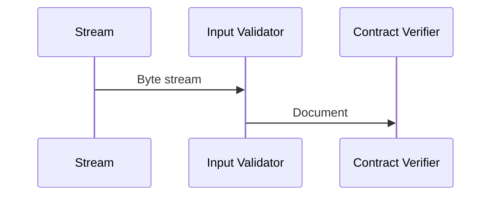

# Input Validator Service

This service splits the stream into a [Data Package](/documents/protocols/hibon/DataPackage.md) and send package to the next service.
The services should check that the package does not exceed the max-package length.

Input:
> - Package Byte stream

Output:
> - [HiBON](/documents/protocols/hibon/Hash_invariant_Binary_Object_Notation.md). 

The services does the following:
- Check that the size of the package does not exceed max-package length.
- Puts the length and the package into one byte string.
- Check that the byte stream is a correct HiBON document format.
- Send the data-package to the Contract Verifier service.

