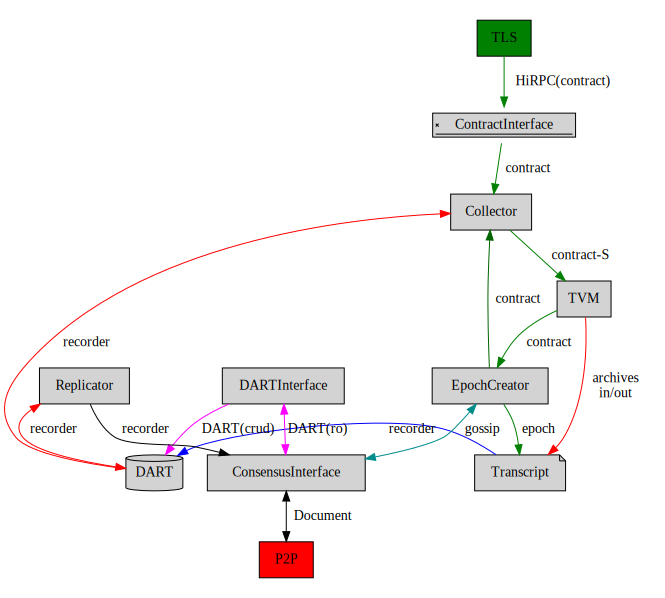
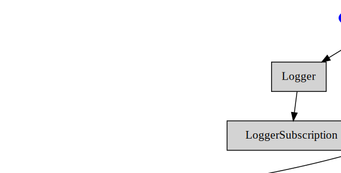

# Tagion Network Architecture

## Description of the services in a node
A node consist of the following services.

* [tagionwave](/src/bin-wave/README.md) is the main task responsible all the service
- Core services
	- [Tagion](/documents/architecture/Tagion.md) is the service which handles the all the services related to the rest of the services (And run the HashGraph).
	- [TagionFactory](/documents/architecture/TagionFactory.md) This services takes care of the *mode* in which the network is started.
	- [TVM](/documents/architecture/TVM.md) ("Tagion Virtual Machine") is responsible for executing the instructions in the contract ensuring the contracts are compliant with Consensus Rules producing outputs. It send new, non consensus, contracts to the Consensus service.
	- [DART](/documents/architecture/DART.md "Distributed Archive of Random Transactions") service Takes care of the handling data-base instruction and read/write to the physical file system.
	- [DARTSync](/documents/architecture/DARTSync.md) Handles the synchronization of the DART to other remote nodes.
	- [Recorder](/documents/architecture/Recorder.md) Handles the recorder chain (A Recorder is the write/remove sequency to the DART).
	- [Communication](/documents/architecture/Communication.md) service is responsible for ensuring a valid data format of HiRPC requests and compliance with the HiRPC protocol before it is executed in the system. 
	- [Collector](/documents/architecture/Collector.md) service is responsible for collecting input data for a Contract and ensuring the data is valid and signed before the contract is executed by the TVM.
	- [Transcript](/documents/architecture/Transcript.md) Executes transactions in the epoch produced by the HashGraph and generates a Recorder.
	- [Consensus](/documents/architecture/Consensus.md) service ensures asynchronous byzantine fault-tolerant consensus with Hashgraph producing an ordered output, an Epoch. 
	- [EpochDump](/documents/architecture/EpochDump.md) Write the Epoch to a file as a backup.
	- [P2P](/documents/architecture/P2P.md "Peer to Peer") is used to connect the p2p network.
	- [Coordinator](/documents/architecture/Coordinator.md) Registration of the actor in system.

* Support services
	* [Logger](/documents/architecture/Logger.md) takes care of handling the logger information for all the services.
	* [LoggerSubscription](/document/architecture/LoggerSubscription.md) The logger subscript take care of handling remote logger and event logging.
	* [Monitor](/documents/architecture/Monitor.md) Monitor interface to display the state of the HashGraph.

## Data Message flow
This graph show the primary data message flow in the network.

## Tagion Service Hierarchy

This graph show the supervisor hierarchy of the services in the network.

The arrow indicates ownership is means of service-A points to service-B. Service-A has ownership of service-B.

This means that if Service-B fails service-A is responsible to handle and take-care of the action to restart or other action.

