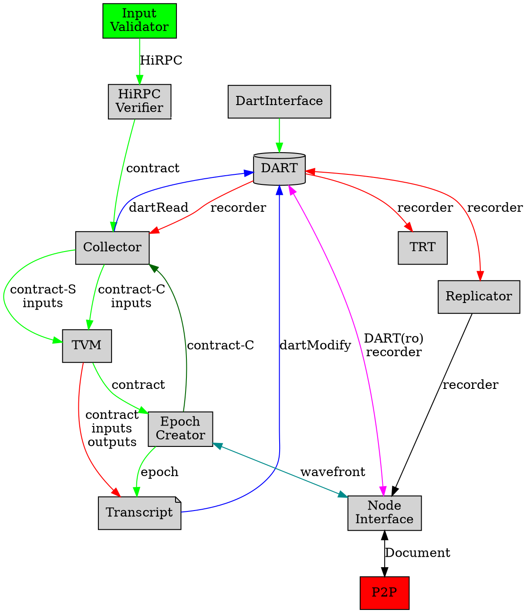
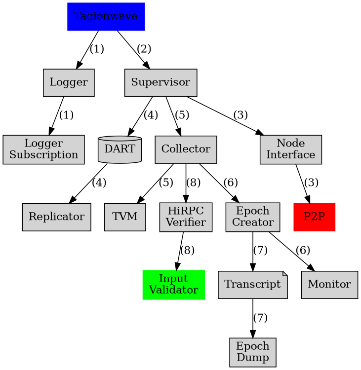

# Tagion Network Architecture

## Description of the services in a node
A node consist of the following services.

* [tagionwave](/src/bin-wave/README.md) is the main task responsible all the service
- Main services
	- Supervisor manages all the other services
    - [Input Validator](/documents/architecture/InputValidator.md) This service handle the data-stream input to the network.
    - [HiRPC Verifier](/documents/architecture/HiRPCVerifier.md) service is responsible for receiving contracts, ensuring a valid data format of HiRPC requests and compliance with the HiRPC protocol before it is executed in the system. 
	- [Collector](/documents/architecture/Collector.md) service is responsible for collecting input data for a Contract and ensuring the data is valid and signed before the contract is executed by the TVM.
	- [TVM](/documents/architecture/TVM.md) ("Tagion Virtual Machine") is responsible for executing the instructions in the contract ensuring the contracts are compliant with Consensus Rules producing outputs and sending new contracts to the Epoch Creator.
	- [Transcript](/documents/architecture/Transcript.md) service is responsible for producing a Recorder ensuring correct inputs and output archives including no double input and output in the same Epoch and sending it to the DART.
	- [Epoch Creator](/documents/architecture/EpochCreator.md) service is responsible for resolving the Hashgraph and producing a consensus ordered list of events, an Epoch. 
	- [DART](/documents/architecture/DART.md "Distributed Archive of Random Transactions") service is reponsible for executing data-base instruction and read/write to the physical file system.
	- DART Interface handles outsite read requests to the dart
    - TRT "Transaction reverse table" stores a copy of the owner to bill relationship.
	- [Replicator](/documents/architecture/Replicator.md) service is responsible for keeping record of the database instructions both to undo, replay and publish the instructions sequantially.
	- [Node Interface](/documents/architecture/NodeInterface.md) service is responsible for handling and routing requests to and from the p2p node network.

* Support services
	- [Logger](/documents/architecture/Logger.md) takes care of handling the logger information for all the services.
	- [Logger Subscription](/documents/architecture/LoggerSubscription.md) The logger subscript take care of handling remote logger and event logging.
	- [Monitor](/documents/architecture/Monitor.md) Monitor interface to display the state of the HashGraph.

## Data Message flow
This graph show the primary data message flow in the network.

## Tagion Service Hierarchy

This graph show the supervisor hierarchy of the services in the network.

The arrow indicates ownership is means of service-A points to service-B. Service-A has ownership of service-B.

This means that if Service-B fails service-A is responsible to handle and take-care of the action to restart or other action.

The (number) in the graph indicates the ordered in which the services should be started.

