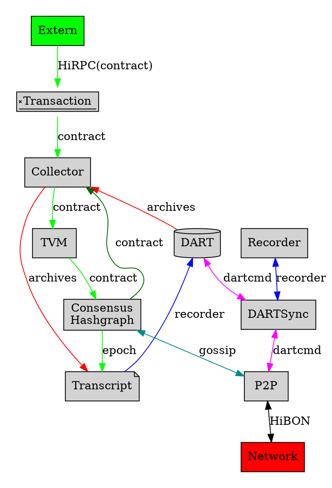
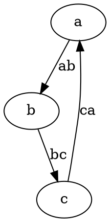
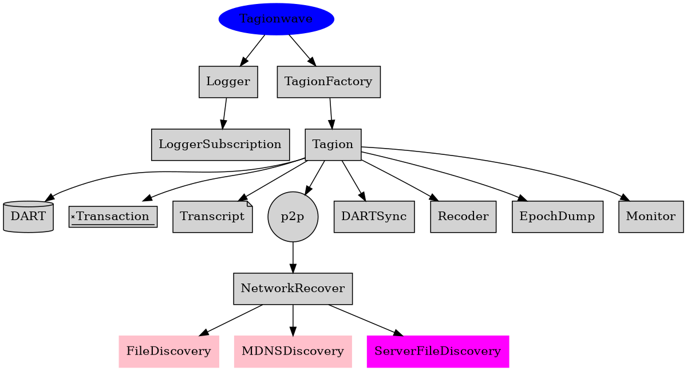
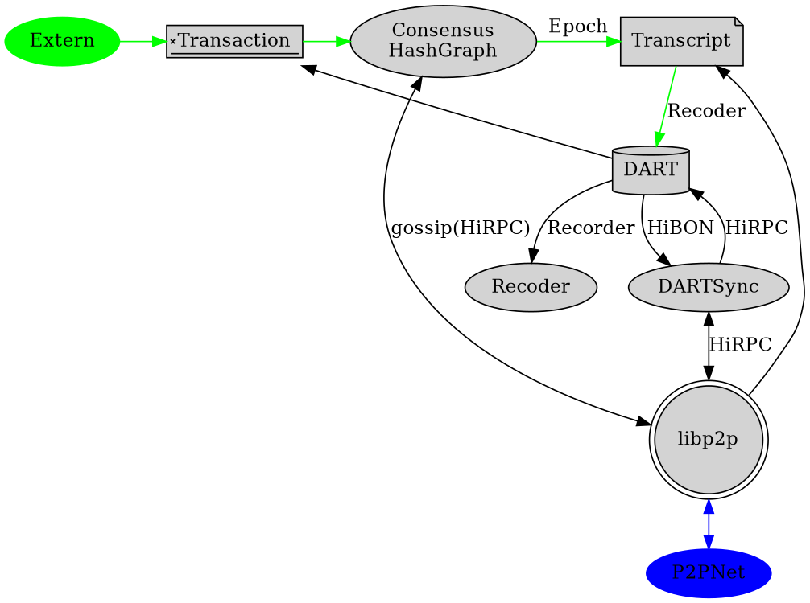
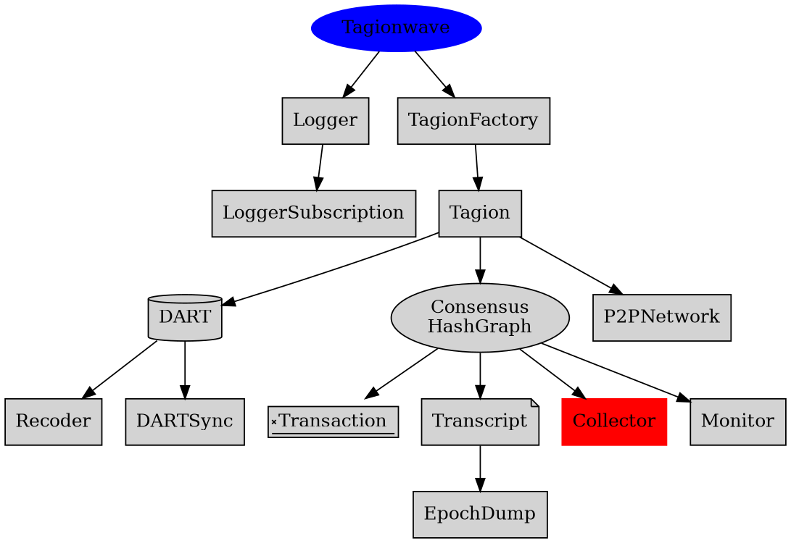
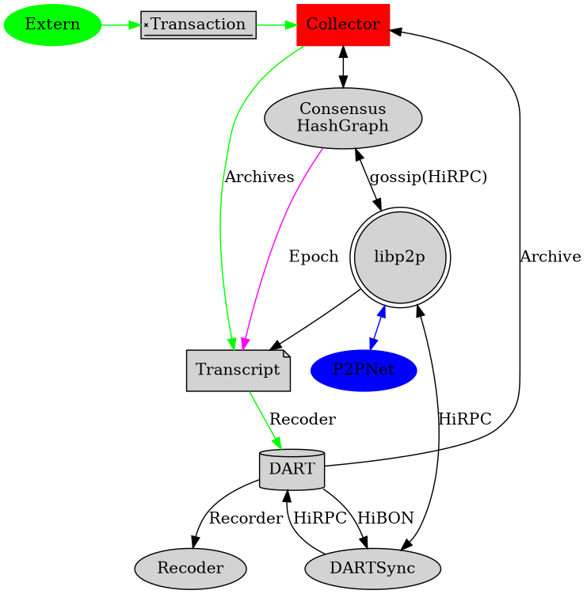

# Tagion Network Architecture

## Description of the services in a node
A node consist of the following services.

* [tagionwave](/src/bin-wave/README.md) is the main task responsible all the service
* [Logger](/documents/acrhitecture/Logger.md) takes care of handling the logger information for all the services.
* [LoggerSubscription]() The logger subscript take care of handling remote logger and event logging.
* [TagionFactory](/documents/architecture/TagionFactory.md) This services takes care of the *mode* in which the network is started.
* [Tagion](/documents/architecture/Tagion.md) is the service which handles the all the services related to the rest of the services (And run the HashGraph).
* [TVM](/documents/architecture/TVM.md) Virtual machine for executing the smart contract functions.
* [DART](/documents/architecture/DART.md) Takes care of the handling data-base instruction and read/write to the physical file system.
* [DARTSync](/documents/architecture/DARTSync.md) Handles the synchronization of the DART to other remote nodes.
* [Recorder](/documents/architecture/Recorder.md) Handles the recorder chain (A Recorder is the write/remove sequency to the DART).
* [Transaction](/documents/architecture/Transaction.md) Handles the validation of a smart contract before it is send to the HashGraph.
* [Consensus](/documents/architecture/Consensus.md) Executes transactions in the epoch produced by the HashGraph and generates a Recorder.
* [Transcript](/documents/architecture/Transcript.md) Executes transactions in the epoch produced by the HashGraph and generates a Recorder.
* [EpochDump](/documents/architecture/EpochDump.md) Write the Epoch to a file as a backup.
* [Monitor](/documents/architecture/Monitor.md) Monitor interface to display the state of the HashGraph.
* [Consensus](/documents/architecture/Consensus.md) HashGraph consensus services.
* [P2P](/documents/architecture/P2P.md) is used to connect the p2p network.
* [Register](/documents/architecture/Register.md) Register for the task and services.

The arrow indicates ownership is means of service-A points to service-B. Service-A has ownership of service-B.

This means that if Service-B fails service-A is responsible to handle and take-care of the action to restart or other action.

### Tagion Service Hierarchy

### Information flow between the services.

The arrows should the most import communication between the services.

All services can send logger data to the Logger server, which is not shown on the figure.

### Update Tagion Service Hierarchy

### Update information flow between the services.
This communication includes the Collector services

