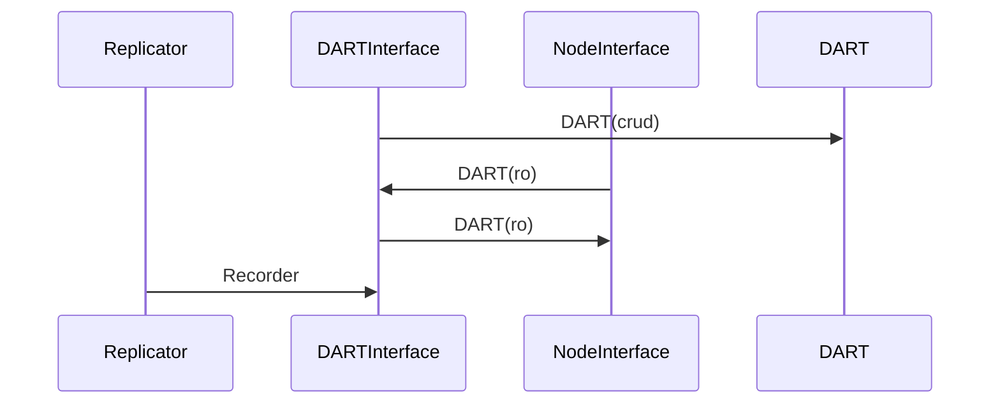

# Node Interface Services

This is responsible for handling and routing request from the p2p node network.

All the package information is in **HiPRC** format.

Input:
  - 

```mermaid
sequenceDiagram
    participant Replicator 
    participant DARTInterface 
    participant NodeInterface 
    DARTInterface ->> DART: DART(crud)
    NodeInterface ->> DARTInterface: DART(ro)
    DARTInterface ->> NodeInterface: DART(ro)
    Replicator ->> DARTInterface: Recorder
```

