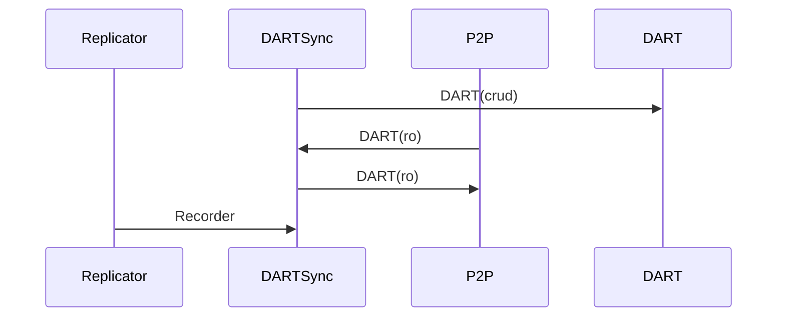

# Peer to Peer Services

This services takes care of the P2P network interface used for the general network correction and the
Gossip protocol.

All the package information is in **HiPRC** format.

Input:
  - 

