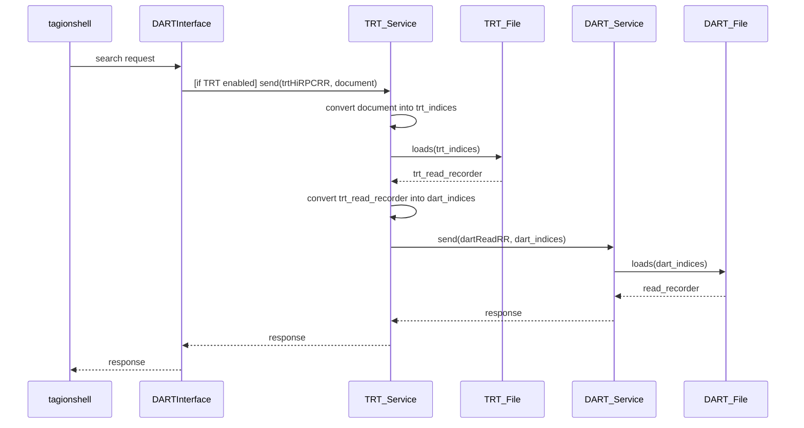

# TRT (Transaction Reverse Table)

TRT is an auxiliary tool for significantly reducing search time in the DART database

It stands as middleware during writing to DART and saves required metadata to effectively access bills with specific public keys

The TRT requires its own dart file that could be placed alongside with node's dart file or elsewhere

---

TRT's lifecycle consists of 3 actions:
1. Creating genesis TRT dart
2. Modifying TRT with DART recorder
3. Reading from DART using TRT (steps 2 and 3 could be initiated multiple times in accidental order)

TRT Archives:
The TRT dart file contains TRTArchive records and basically works as associative array. Where pairs key-value   looks like:
```
TRTArchive {
    @label("#$Y") Pubkey owner; // key
    DARTIndex[] indices;        // value
}
```
So effective search by bill's owner could be performed

### Modify request

When DART service receives recorder to write into DART file, it also sends this recorder to TRT service (if TRT is enabled).

TRT service filters only bills from the given recorder, converts them into TRTArchives and stores in TRT


### Read request

When DARTInterface receives read request, it check whether TRT is enabled and uses its stored indices for direct access to requested bills in DART


