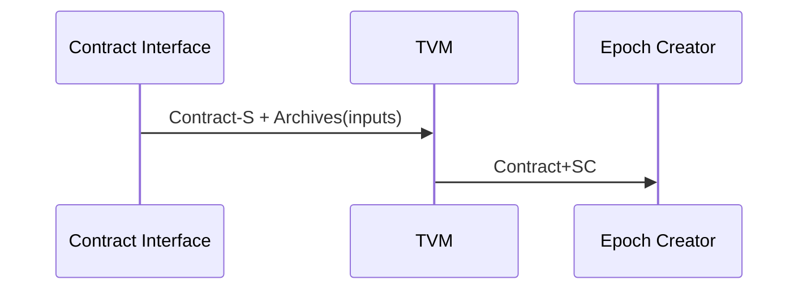

# TVM (Tagion Virtual Machine)

The TVM is responsible for executing the instructions in the contract ensuring the contract is compliant with Consensus Rules producing outputs. 
It send new, non-consensus, contracts to the Epoch Creator Service.

Input: 

- A Contract-S (Signed) and DART archives received from the [Collector](/documents/architecture/Collector.md) Service.
- A Contract-SC (Signed Consensus) and DART archives received from the [Collector](/documents/architecture/Collector.md) Service.

Output:

- A Contract-SC (Signed Consensus) that is compliant with Consensus Rules sent to the [Epoch Creator](/documents/architecture/EpochCreator.md) Service.
- The draft output and input DART archives is sent to [Transcript](/documents/architecture/Transcript.md) Service.

The service does the following:

- Loads the Consensus Rules (only Tagion to start with).
- Loads the input data.
- Executes the instruction(s).
    - Ensures the intructions are valid.
    - Ensures the intructions follow the Consensus Rules.
    - Executes the instructions and produces output draft archives
- If input was Contract-S then a Contract-SC is sent to the Epoch Creator Service.
- Sends output draft archives and input archives to Transcript Service.

