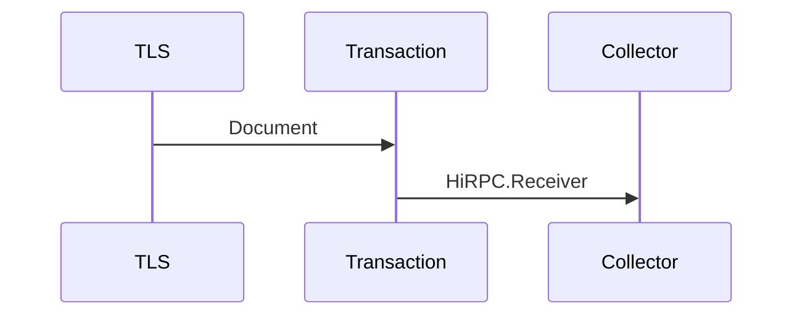

# Transaction Service

The service is responsible for ensuring a valid data format of HiRPC requests and HiBON document before it is executed in the system. 
It validates the [HiPRC](/documents/protocols/hibon/Hash_invariant_Remote_Procedure_Call.md) request and [HiBON](/documents/protocols/hibon/Hash_invariant_Binary_Object_Notation.md) data format. 

The HiRPC contains the contract and data payload for a transaction. 

Input: 

  - A HiBON Document. 
  - Sender: TLS/TCP Service.

Output:

  - A HiRPC.Receiver request.
  - Receiver: [Collector](/documents/architecture/Collector.md) Service.

The service does the following:

  - Check the data package comply with size limitation.
  - Validate the HiBON document and HiRPC request are correct formatted.
  - Validates signature on permissioned HiRPC request. 

The acceptance criteria specification can be found in [Transaction_services](/bdd/tagion/testbench/services/Transaction_service.md).

