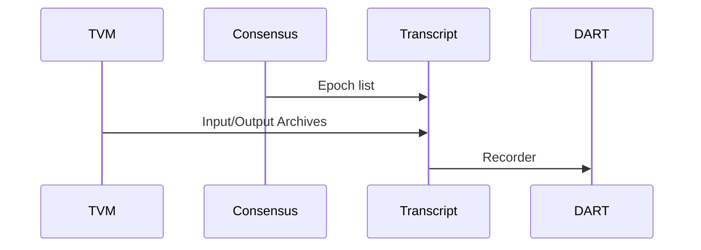

# Transcript Service

This services produces an Recorder from an Epoch according to the consensus rules.

Input:
  - Receives an ordered list of Epoch's.

Request:
  - Request to all the in/outputs archives from the TVM.

Output:
  - Produce a DART-recorder from the in/output archives.

The acceptance criteria specification can be found in [Transcript_services](/bdd/tagion/testbench/services/Transaction_service.md).

