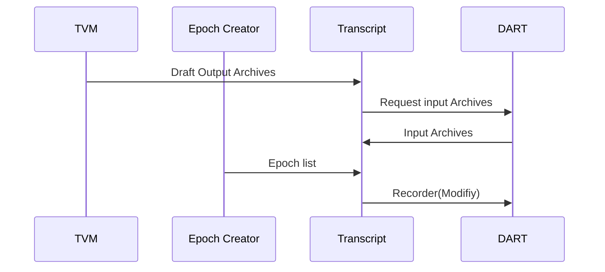

# Transcript Service

This service is responsible for producing a Recorder ensuring correct inputs and output archives including no double input and output in the same Epoch and sending it to the DART.

Input:
  - Receives an Epoch list contaning ordered events from the [Epoch Creator](/documents/architecture/EpochCreator.md).
  - Receives all Draft outputs archives from the [TVM](/documents/architecture/TVM.md).

Request:
  - Request to all the inputs archives from the [DART](/documents/architecture/DART.md).

Output:
  - A DART-recorder is sent to the [DART](/documents/architecture/DART.md)

;; The acceptance criteria specification can be found in [Transcript_services](/bdd/tagion/testbench/services/ContractInterface_service.md).

