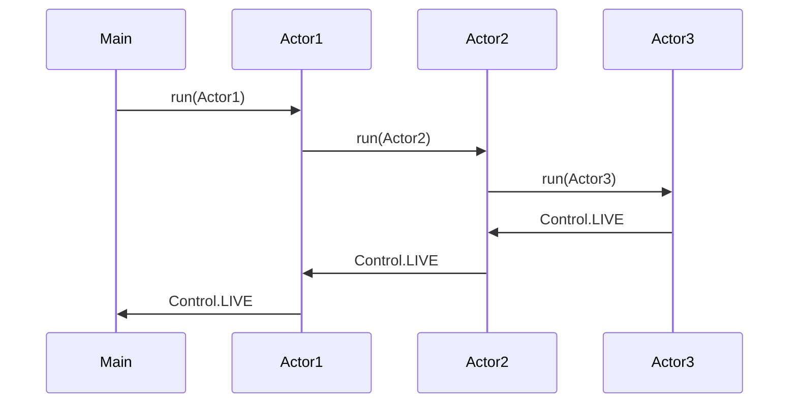
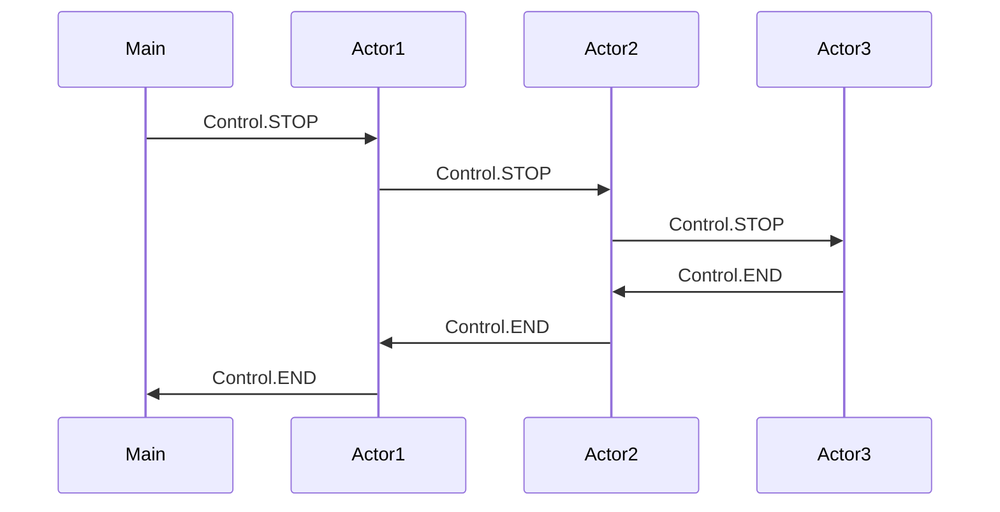

# Requirement for the Actor base multitasking

And actor is a task which are able to send and receive messages from other tasks.
The actors has a hierarchical structure where the owner of an actor is call a supervisor and the actor owned by the supervisor is call a child.

When an actor fails the error should be send to the supervisor and the supervisor should decide what should be done.
The error send to the should have highest priority.

A supervisor should able to stop one or all children and if the actor requested to be stopped then it should safe stop all children owned by this actor.

And actor can have in 4 stages

| Mode | Stage | Description |
| --- | --- | --- |
| 1. |STARING | When actor is starting and initializing the actor |
| 2. |ALIVE   | When the actor has started a LIVE signal is send to the supervisor |
| 3. |ERROR   | Error (Exception) is send to the supervisor |
| 4. |STOP    | When the actor stops a END signal is send to the supervisor |

A child is stop when a supervisor send a STOP signal to the child and the child sends an END when it stops if an error occurs in the child the error (Exception) should be send to the supervisor.

An actor has a set of receives methods and this set of methods should never change as long as the actor is alive.

## Start and Stop of Actor hierarchy 

This diagram show an example the startup sequence of the supervisor hierarchy.

This diagram show the stop sequence.

