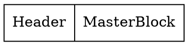
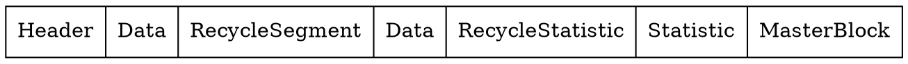

# BlockFile 

The BlockFile, utilized under our DART, functions as a block-based storage system, where data is segregated into fixed-size blocks, typically a few kilobytes, and assigned a unique index, which the file system uses to track the location of the stored data. When a file is saved or modified, the file system writes the data to one or more available blocks and updates its index accordingly. 

The BlockFile has a wrapper on the blocks in order to make development easier. This is called BlockSegment.
## BlockSegment
The BlockSegment is a `Document` (immutable HiBON) and a `Index`. All data stored in the BlockFile is stored using Documents (except the headerblock).
One BlockSegment equals one Document. Therefore a Document can span multiple blocks. The Index specifies where the Document is written to in the BlockFile.
Since the Document might fill 1.5 blocks a function is needed in order to get the correct number of blocks. In order to get the number of blocks we do the following:
* Get the size of the Document. (LEB128)

$$ \text{numberOfBlocks} = \lfloor \frac{\text{size}}{\text{BLOCK\_SIZE}} \rfloor + (\text{size mod BLOCK\_SIZE = 0} \text{ ? 0 : 1})$$

Where the size refers to the `size_t` of the Document. Therefore the `BlockSegment` contains the following:

| Variable Name | Type      | Label       | Description                                           |
| ------------- | --------- | ----------- | ------------------------------------------------------ |
| `index`       | `Index`   | `"index"`   | Block index where the document is stored or should be stored |
| `doc`         | `Document`| `"Document"`| Document stored in the segment                        |


## General BlockFile structure
An empty blockfile without any archives in it has the following structure:

The `HeaderBlock` is always the first block and specifies how to read the file. The MasterBlock is always the last block and is the only one with references backwards in the blockfile. The following is what a blockfile with data might look like.

The following sections describe what the different segments are.

### HeaderBlock
The HeaderBlock contains the following information:

| Variable Name   | Type  | Description                       |
| ------------ | ----- | --------------------------------- |
| `label`      | `char[LABEL_SIZE]` | Label to set the `BlockFile` type |
| `block_size` | `uint` | Size of the block's               |
| `create_time`| `long` | Time of creation                  |
| `id`         | `char[ID_SIZE]`  | Short description string          |

The HeaderBlock is not a Document since it needs to be compatible with standard file lookups. 
### MasterBlock
When the HeaderBlock is read, it sets the variable used by the masterblock called `last_block_index`. This is because we know that the MasterBlock is always the last block.
$$ \text{last\_block\_index} = \frac{\text{file.size}}{\text{BLOCK\_SIZE}} -1 $$
The reason we subtract 1 is to get the Index of where the masterblock begins. The masterblock is **always one block**.

The MasterBlock has pointers to all other different important blocks in the BlockFile. It contains the following information:

| Variable Name              | Type   | Label        | Description                                  |
| -------------------------- | ------ | ------------ | -------------------------------------------- |
| `recycle_header_index`     | `Index`| `"head"`     | Points to the root of the recycle block list |
| `root_index`               | `Index`| `"root"`     | Points to the root of the database           |
| `statistic_index`          | `Index`| `"block_s"`  | Points to the statistic data                 |
| `recycler_statistic_index` | `Index`| `recycle_s"` | Points to the recycler statistic data        |

The labels indicate the names that are used in the Document stored in the MasterBlock.

### RecycleSegments
RecycleSegments are special, because they do not point to the next `BlockSegment` in the `BlockFile`, but instead points to the next `RecycleSegment`. 
This allows us to get a list of all the segments that are "recycled. They contain the following:

| Variable Name | Type   | Label    | Description           |
| ------------- | ------ | -------- | --------------------- |
| `index`       | `Index`| `VOID`   | Current field's index |
| `next`        | `Index`| `"next"` | Points to next index  |
| `size`        | `uint` | `"size"` | Size of the field     |

As it can be seen the `index` is not saved in the `HiBONRecord`. This is because it is not neccesary in order to produce the list of RecycleSegments. 

The RecycleSegments are stored in a RedBlackTree in memory. The reason they are stored in memory is in order to quickly find a segment that fits.
The read is instantiated from the `recycler_header_index` which is a part of the [MasterBlock](#masterblock). The last segment in the recyclersegments points to nothing: `Index.init`. 
The code for reading all the recyclersegments are as follows.

```d
// The last element points to a Index.init. 
// Therefore we continue until we reach this.
while (index != Index.init) {
   auto add_segment = new RecycleSegment(owner, index);
   insert(add_segment);
   index = add_segment.next;
}
```

### Statistic Blocks
Statistic segments are used for analyzing the amount of blocks and how well they are used, and how many recycle segments. 
They use the underlying `logger/Statistic` module, and are Type Definitions.
```d
alias BlockFileStatistic = Statistic!(uint, Yes.histogram);
alias RecyclerFileStatistic = Statistic!(ulong, Yes.histogram);
```
The Yes.histogram indicates that we are keeping track each time `blockfile.store` is called. This means that we can see how the number of ex. `RecycleSegments` grows over time.

The following is an example of the command: `blockutil test.drt --recyclerstatistic`.

```
N=101 sum2=704 sum=240 min=0 max=5
   0|   8| ########
   1|  12| ############
   2|  32| ################################
   3|  34| ##################################
   4|  13| #############
   5|   2| ##
```


