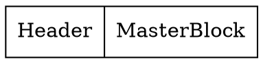

# BlockFile 

The BlockFile, utilized under our DART, functions as a block-based storage system, where data is segregated into fixed-size blocks, typically a few kilobytes, and assigned a unique index, which the file system uses to track the location of the stored data. When a file is saved or modified, the file system writes the data to one or more available blocks and updates its index accordingly. 

The BlockFile has a wrapper on the blocks in order to make development easier. This is called BlockSegment.
## BlockSegment
The BlockSegment is a `Document` (immutable HiBON) and a `Index`. All data stored in the BlockFile is stored using Documents (except the headerblock).
One BlockSegment equals one Document. Therefore a Document can span multiple blocks. The Index specifies where the Document is written to in the BlockFile.
Since the Document might fill 1.5 blocks a function is needed in order to get the correct number of blocks. In order to get the number of blocks we do the following:
* Get the size of the Document. (LEB128)

$$ \text{numberOfBlocks} = \lfloor \frac{\text{size}}{\text{BLOCK\_SIZE}} \rfloor + (\text{size mod BLOCK\_SIZE = 0} \text{ ? 0 : 1})$$

Where the size refers to the `size_t` of the Document.


## General BlockFile structure
An empty blockfile without any archives in it has the following structure:

The `HeaderBlock` is always the first block and specifies how to read the file. The MasterBlock is always the last block and is the only one with references backwards in the blockfile.

### HeaderBlock
The HeaderBlock contains the following information:

| Variable Name   | Type  | Description                       |
| ------------ | ----- | --------------------------------- |
| `label`      | `char[LABEL_SIZE]` | Label to set the `BlockFile` type |
| `block_size` | `uint` | Size of the block's               |
| `create_time`| `long` | Time of creation                  |
| `id`         | `char[ID_SIZE]`  | Short description string          |

The HeaderBlock is not a Document since it needs to be compatible with standard file lookups. 
### MasterBlock
When the HeaderBlock is read, it sets the variable used by the masterblock called `last_block_index`. This is because we know that the MasterBlock is always the last block.
$$ \text{last\_block\_index} = \frac{\text{file.size}}{\text{BLOCK\_SIZE}} -1 $$
The reason we subtract 1 is to get the Index of where the masterblock begins. The masterblock is **always one block**.

The MasterBlock has pointers to all other different important blocks in the BlockFile. It contains the following information:

| Variable Name                 | Type   | Label        | Description                                  |
| -------------------------- | ------ | ------------ | -------------------------------------------- |
| `recycle_header_index`     | `Index`| `"head"`     | Points to the root of the recycle block list |
| `root_index`               | `Index`| `"root"`     | Points to the root of the database           |
| `statistic_index`          | `Index`| `"block_s"`  | Points to the statistic data                 |
| `recycler_statistic_index` | `Index`| `recycle_s"` | Points to the recycler statistic data        |

The labels indicate the names that are used in the Document stored in the MasterBlock.


<!-- ```graphviz
digraph {
   a [shape=record label="left | {above|middle|below} | <f1>right"]
   b [shape=record label="{row1\l|row2\r|{row3\nleft|<f2>row3\nright}|row4}"]
   c [shape=record label="left | above|middle|below | right"]
   d [shape=record label="XXX|XXX|XXXX|XX|XXXXX"]
}
```


