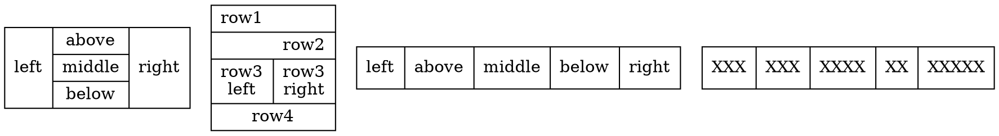
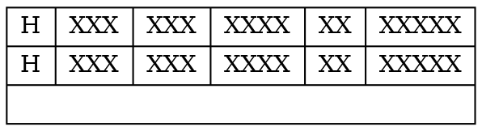

# BlockFile 

The BlockFile, utilized under our DART, functions as a block-based storage system, where data is segregated into fixed-size blocks, typically a few kilobytes, and assigned a unique index, which the file system uses to track the location of the stored data. When a file is saved or modified, the file system writes the data to one or more available blocks and updates its index accordingly. 

The BlockFile has a wrapper on the blocks in order to make development easier. This is called BlockSegment.

## BlockSegment
The BlockSegment is a Document (immutable HiBON). All data stored in the BlockFile is stored using Documents (except the headerblock).
One BlockSegment equals one Document. Therefore a Document can span multiple blocks. 
Since the Document might fill 1.5 blocks a function is needed in order to get the correct number of blocks. In order to get the number of blocks we do the following:
* Get the size of the document. (LEB128)

$ uint numberOfBlocks = \frac{documentSize}{BLOCK_SIZE} $

