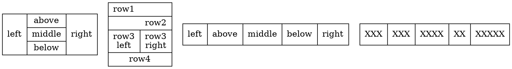
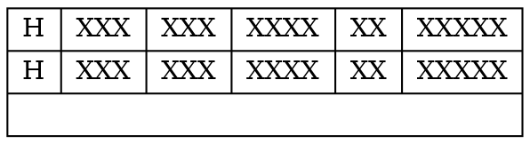

# Block file recycler

```graphviz
digraph {
   a [shape=record label="left | {above|middle|below} | <f1>right"]
   b [shape=record label="{row1\l|row2\r|{row3\nleft|<f2>row3\nright}|row4}"]
   c [shape=record label="left | above|middle|below | right"]
   d [shape=record label="XXX|XXX|XXXX|XX|XXXXX"]
}
```

```graphviz
digraph {
   e [shape=record label="{
   {H|XXX|XXX|XXXX|XX|XXXXX}|
   {H|XXX|XXX|XXXX|XX|XXXXX}|
   }"]
}
```
