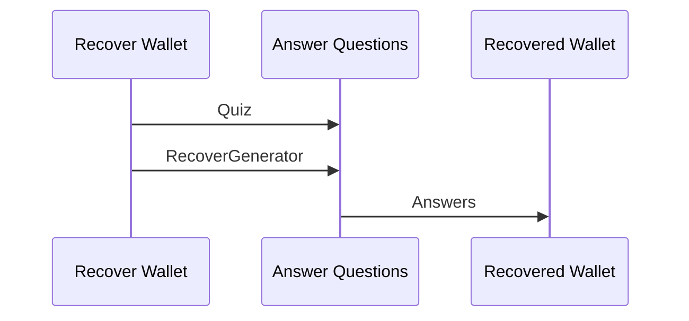
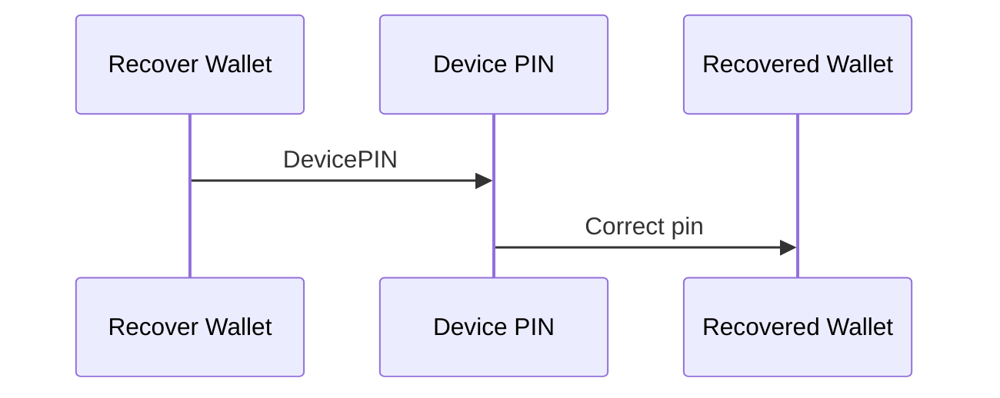

# Tagion wallet

The tagion wallet is a package [wallet](https://ddoc.tagion.org/tagion.wallet.html) which handles digital signature, signing of smart contract/payment and also information about the amount in the wallet.

## SecureWallet module
The secure wallet module takes care of holding the flowing informations.

1. Wallet generator (Enables the recovery of the wallet seed)
2. Devices recovery mechanism (Devices specific pin) 
3. Account details holds the information of the derivers,


[SecureWallet](https://ddoc.tagion.org/tagion.wallet.SecureWallet.SecureWallet.html)

### Create Wallet (method 1)

The first way to create a wallet is to select and number of question of which only the owner knows the question to. When the wallet is create owner answers the questions and a generator is created.

The owner can also supply a Device pin-code.

```mermaid
sequenceDiagram
    participant Answer Questions
    participant Create Wallet
    participant Wallet Generator
    Answer Questions->>Create Wallet : Quiz(Question,Answers)
    Answer Questions->>Create Wallet : Device pin-code
    Create Wallet->>Wallet Generator : RecoverGenerator
```
This process produces the flowing data.
1. [Quiz](https://ddoc.tagion.org/tagion.wallet.WalletRecords.Quiz.html) which hold a list of questions
2. [RecoderGenerator](https://ddoc.tagion.org/tagion.wallet.WalletRecords.RecoverGenerator.html) which enables to recover the private-key for the questions in the *Quiz* and the correct answers.
3. [DevicePIN](https://ddoc.tagion.org/tagion.wallet.WalletRecords.DevicePIN.html) holds information which can generate the private-key from the correct device-pin.

#### Recover from the questions

The wallets private-key can be recovered with the correct answer


Recover the wallet from the devices pin-code.


### Create Wallet (method 2 BIP39)


### Create Wallet (method 1+2)


## Payment

The wallet is used both to send and receiver money. The exchange to information between the wallet is done via an [Invoice]()

## Transfer to an invoice

The make a payment from on
