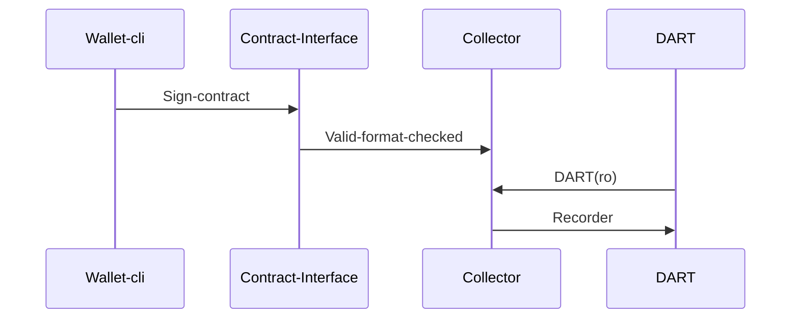

# Project Goal first half year 2023

## Developer mode (or mode -1)

This project should be a standard alone tool-package which enable costumers to test the interface to the Tagion network.
The tool should includes.

1. Tool to sign contract (wallet-cli)
2. Database tool to read and write data into the DART (dartutil-cli)
3. Boot strap tool (tagionboot-cli)

### Tasks in part 1
1. DART rim test and bullseye test in (BDD).
2. Contract-Interface test in (BDD).
3. 
 

