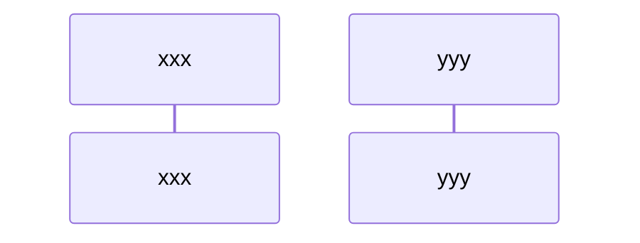

# Simple payment transfer

## Request for payment
The request for payment include an name of the receiver and seed public key.

### Payment Request(TWPR)

| Name        | D-Type       | Description            |  Required |
| ----------- | ------------ | ---------------------- | --------- |
| `$signs`    | [Buffer]()[] | List of $N$ signature  |    Yes    |
| `$contract` | [Contract]() | The contract body      |    Yes    |

Request for payment.

