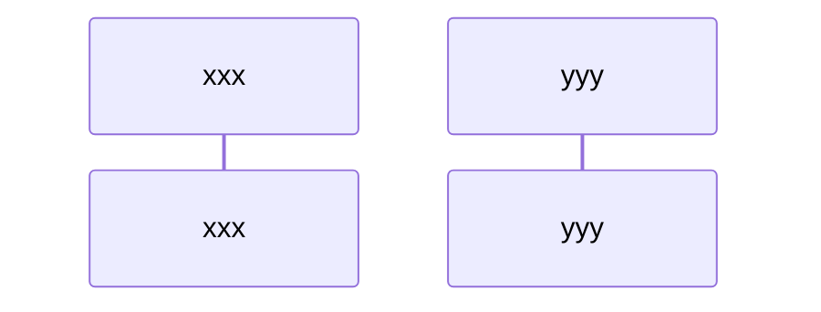

# Simple payment transfer

## Request for payment
The request for payment include an name of the receiver and seed public key.

### Payment Request(TGNRequest)

| Name        | D-Type       | Description            |  Required |
| ----------- | ------------ | ---------------------- | --------- |
| `name`      | string       | Owner or alias name    |    Yes    |
| `$Y`        | [Pubkey]()   | Public key seed        |    Yes    |
| `$D`        | string       | Deriver                |    Yes    |
| `$V`        | $TGN$        | Amount in tagion       |    No     |
| `info`      | [Document]() | Payment information    |    No     |

Request for payment.

